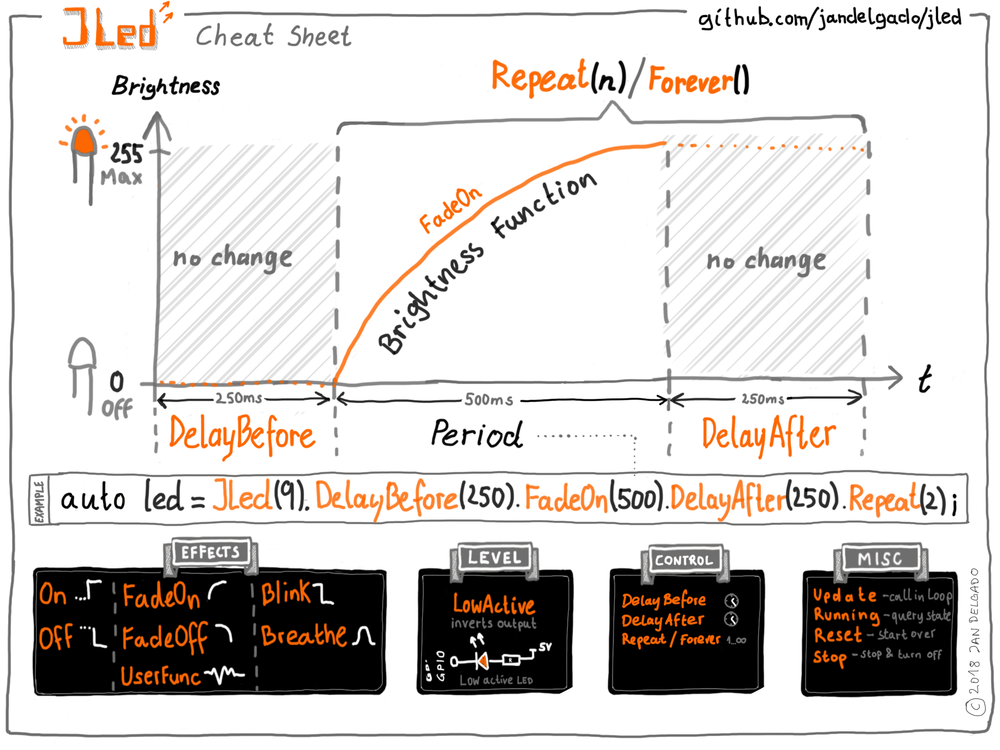

# JLed - Extended LED Library

[](https://travis-ci.org/jandelgado/jled)
[](https://coveralls.io/github/jandelgado/jled?branch=master)

An Arduino library to control LEDs. It uses a **non-blocking** approach and can
control LEDs in simple (**on**/**off**) and complex (**blinking**,
**breathing**) ways in a **time-driven** manner.

JLed got some [coverage on Hackaday](https://hackaday.com/2018/06/13/simplifying-basic-led-effects/)
and someone did a [video tutorial for JLed](https://youtu.be/x5V2vdpZq1w)  - Thanks!

[](examples/multiled)

```c++
// breathe an LED (gpio 9) for 12 seconds.
#include <jled.h>

auto led_breathe = JLed(9).Breathe(1500).Repeat(6).DelayAfter(500);

void setup() { }

void loop() {
  led_breathe.Update();
}
```

## Contents

<!-- vim-markdown-toc GFM -->

* [Features](#features)
* [Cheat Sheet](#cheat-sheet)
* [Installation](#installation)
    * [Arduino IDE](#arduino-ide)
    * [PlatformIO](#platformio)
* [Usage](#usage)
    * [Effects](#effects)
        * [Static on](#static-on)
            * [Static on example](#static-on-example)
        * [Static off](#static-off)
        * [Blinking](#blinking)
            * [Blinking example](#blinking-example)
        * [Breathing](#breathing)
            * [Breathing example](#breathing-example)
        * [FadeOn](#fadeon)
            * [FadeOn example](#fadeon-example)
        * [FadeOff](#fadeoff)
        * [User provided brightness function](#user-provided-brightness-function)
            * [User provided brightness function example](#user-provided-brightness-function-example)
        * [Delays and repeatitions](#delays-and-repeatitions)
            * [Initial delay before effect starts](#initial-delay-before-effect-starts)
            * [Delay after effect finished](#delay-after-effect-finished)
            * [Repetitions](#repetitions)
        * [State functions](#state-functions)
            * [Update](#update)
            * [IsRunning](#isrunning)
            * [Reset](#reset)
            * [Immediate Stop](#immediate-stop)
        * [Misc functions](#misc-functions)
            * [Low active (inverted output)](#low-active-inverted-output)
* [Platform notes](#platform-notes)
    * [ESP8266](#esp8266)
    * [ESP32](#esp32)
    * [STM32](#stm32)
* [Example sketches](#example-sketches)
    * [PlatformIO](#platformio-1)
    * [Arduino IDE](#arduino-ide-1)
* [Extending](#extending)
    * [Support new hardware](#support-new-hardware)
* [Unit tests](#unit-tests)
* [Contributing](#contributing)
* [FAQ](#faq)
    * [How do I check if an JLed object is still being updated?](#how-do-i-check-if-an-jled-object-is-still-being-updated)
    * [How do I restart a effect?](#how-do-i-restart-a-effect)
    * [How do I change a running effect?](#how-do-i-change-a-running-effect)
* [Author and Copyright](#author-and-copyright)
* [License](#license)

<!-- vim-markdown-toc -->

## Features

* non-blocking
* effects: simple on/off, breathe, blink, fade-on, fade-off, user-defined
* supports inverted  polarity of LED
* easy configuration using fluent interface
* Arduino, ESP8266 and ESP32 platform compatible

## Cheat Sheet



## Installation

### Arduino IDE

In the main menu of the Arduino IDE, select `Sketch` > `Include Library` >
`Manage Libraries...` and search for `jled`, then press `install`.

### PlatformIO

Add `jled` to your library dependencies in your `platformio.ini` project file,
e.g.

```ini
...
[env:nanoatmega328]
platform = atmelavr
board = nanoatmega328
framework = arduino
lib_deps=jled
...
```

## Usage

First the LED object is constructed and configured, then the state is updated
with subsequent calls to the `Update()` method, typically from the `loop()`
function. While the effect is active, `Update` returns `true`, otherwise
`false`.

The constructor takes the pin, to which the LED is connected to as
only parameter. Further configuration of the LED object is done using a fluent
interface, e.g. `JLed led = JLed(13).Breathe(2000).DelayAfter(1000).Repeat(5)`.
See examples and [Parameter overview](#parameter-oveview) section below for
further details.

### Effects

#### Static on

Calling `On()` turns the LED on. An optional brightness value can be supplied,
the default value is 255, which is full brightness.
To immediately turn a LED on, make a call like `JLed(LED_BUILTIN).On().Update()`.

##### Static on example

```c++
#include <jled.h>

// turn builtin LED on after 1 second.
auto led = JLed(LED_BUILTIN).On().DelayBefore(1000);

void setup() { }

void loop() {
  led.Update();
}
```

#### Static off

`Off()` works like `On()`, except that it turns the LED off, i.e. sets the
brightness to 0.

#### Blinking

In blinking mode, the LED cycles through a given number of on-off cycles, on-
and off-cycle duration are specified independently.

##### Blinking example

```c++
#include <jled.h>

// blink internal LED every second.
auto led = JLed(LED_BUILTIN).Blink(1000, 500).Forever();

void setup() { }

void loop() {
  led.Update();
}
```

#### Breathing

In breathing mode, the LED smoothly changes brightness using PWM.

##### Breathing example

```c++
#include <jled.h>

// connect LED to pin 13 (PWM capable). LED will breathe with period of
// 2000ms and a delay of 1000ms after each period.
auto led = JLed(13).Breathe(2000).DelayAfter(1000).Forever();

void setup() { }

void loop() {
  led.Update();
}
```

#### FadeOn

In FadeOn mode, the LED is smoothly faded on to 100% brightness using PWM.

##### FadeOn example

```c++
#include <jled.h>

// LED is connected to pin 9 (PWM capable) gpio
auto led = JLed(9).FadeOn(1000).DelayBefore(2000);

void setup() { }

void loop() {
  led.Update();
}
```

#### FadeOff

In FadeOff mode, the LED is smoothly faded off using PWM. The fade starts
at 100% brightness. Internally it is implemented as a mirrored version of
the FadeOn function, i.e. FadeOn(t) = FadeOff(period-t)

#### User provided brightness function

It is also possible to provide a user defined brightness evaluator. The class
must be derived from the `BrightnessEvaluator` class and implement
two methods:

* `uint8_t Èval(uint32_t t)` - the brightness evaluation function that calculates
    a brightness for the given point in time t. The brighness must be returned as
    an unsigned byte, where 0 means led off and 255 means full brightness.
* `uint16_t Period() const` - period of the effect.

    All times are specified in milliseconds.

##### User provided brightness function example

The example uses a user provided function to calculate the brightness.

```c++
TODO
```

#### Delays and repeatitions

##### Initial delay before effect starts

Use the `DelayBefore()` method to specify a delay before the first effect starts.
The default value is 0 ms.

##### Delay after effect finished

Use the `DelayAfter()` method to specify a delay after each repetition of
an effect. The default value is 0 ms.

##### Repetitions

Use the `Repeat()` method to specify the number of repetition. The default
value is 1 repetition. The `Forever()` methods sets to repeat the effect
forever. Each repetition

#### State functions

##### Update

Call `Update()` periodidcally to update the state of the LED. `Update` returns
`true` if the effect is active, and `false` when it finished.

##### IsRunning

`IsRunning()` returns `true` if the current effect is running, else `false`.

##### Reset

A call to `Reset()` bring the JLed object to it's initial state. Use it when
you want to start-over an effect.

##### Immediate Stop

Call `Stop()` to immediately turn the LED off and stop any running effects.
Further calls to `Update()` will have no effect unless the Led is reset (using
`Reset()`) or a new effect activated.

#### Misc functions

##### Low active (inverted output)

Use the `LowActive()` modifier  when the connected LED is low active. All output
will be inverted by JLed (i.e. instead of x, the value of 255-x will be set).

## Platform notes

### ESP8266

The DAC of the ESP8266 operates with 10 bits, every value JLed writes out gets
automatically scaled to 10 bits, since JLed internally only uses 8 bits.  The
scaling methods makes sure that min/max relationships are preserved, i.e. 0 is
mapped to 0 and 255 is mapped to 1023. When using a user defined brightness
function on the ESP8266, 8 bit values must be returned, all scaling is done by
JLed transparently for the application, yielding platform independent code.

### ESP32

The ESP32 Arduino SDK does not provide an `analogWrite()` function. To
be able to use PWM, we use the `ledc` functions of the ESP32 SDK.
(See [esspressif documentation](https://docs.espressif.com/projects/esp-idf/en/latest/api-reference/peripherals/ledc.html) for details).

The `ledc` API connects so called channels to GPIO pins, enabling them to use
PWM. There are 16 channels available. Unless otherwise specified, JLed
automatically picks the next free channel, starting with channel 0 and wrapping
over after channel 15. To manually specify a channel, the JLed object must be
constructed this way:

```
TODO
auto esp32Led = JLed(Esp32AnalogWriter(2, 7)).Blink(1000, 1000).Forever();
```

The `Esp32AnalogWriter(pin, chan)` constructor takes the pin number as the
first argument and the channel number on second position. Note that using the
above mentioned constructor yields non-platform independent code.

See [ESP32 multi led example](examples/multiled_esp32).

### STM32

I had success running JLed on a [STM32 Nucleo64 F401RE
board](https://www.st.com/en/evaluation-tools/nucleo-f401re.html) using this
[STM32 Arduino
core](https://github.com/rogerclarkmelbourne/Arduino_STM32/tree/master/STM32F4)
and compiling from the Arduino IDE. Note that the `stlink` tool may be
necessary to upload sketches to the micro controller.

Platformio does not support the Arduino platform for the F401RE in the [current
version](https://docs.platformio.org/en/latest/boards/ststm32/nucleo_f401re.html),
but has support on the [master
branch](https://github.com/platformio/platform-ststm32.git). See
[plaform.ini](platform.ini) for an example on how the arduino framework with
this board.

## Example sketches

Examples sketches are provided in the [examples](examples/) directory.

### PlatformIO

To build an example using [the PlatformIO ide](http://platformio.org/), simply
uncomment the example to be built in the [platformio.ini](platformio.ini)
project file, e.g.:

```ini
...
[platformio]
; uncomment example to build
src_dir = examples/hello
;src_dir = examples/breathe
...
```

### Arduino IDE

To build an example sketch in the Arduino IDE, simply select an example from
the `File` > `Examples` > `JLed` menu.

## Extending

### Support new hardware

JLed uses a very thin hardware abstration layer (hal) to abstract access to the
acutal used MCU (e.g. ESP32, ESP8266). The hal objects encapsulate access to
the GPIO and time functionality of the MCU under the framework being used.
During unit test, mocked hal instances are used, enabling tests to check the
generated output. 

## Unit tests

JLed comes with an exhaustive host based unit test suite. Info on how to run
the host based provided unit tests [is provided here](test/README.md).

## Contributing

* fork this repository
* create your feature branch
* add code
* add unit test(s)
* add documentation
* make sure linter does not report problems (make lint)
* commit changes
* submit a PR

## FAQ

### How do I check if an JLed object is still being updated?

Check the return value of the `Update()` method: the method returns `true` if
the effect is still running, otherwise `false'.

### How do I restart a effect?

Call `Reset()` on a `JLed` object to start over.

### How do I change a running effect?

TODO


## Author and Copyright

Copyright 2017, 2018 by Jan Delgado, jdelgado[at]gmx.net.

## License

[MIT](LICENSE)

