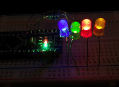
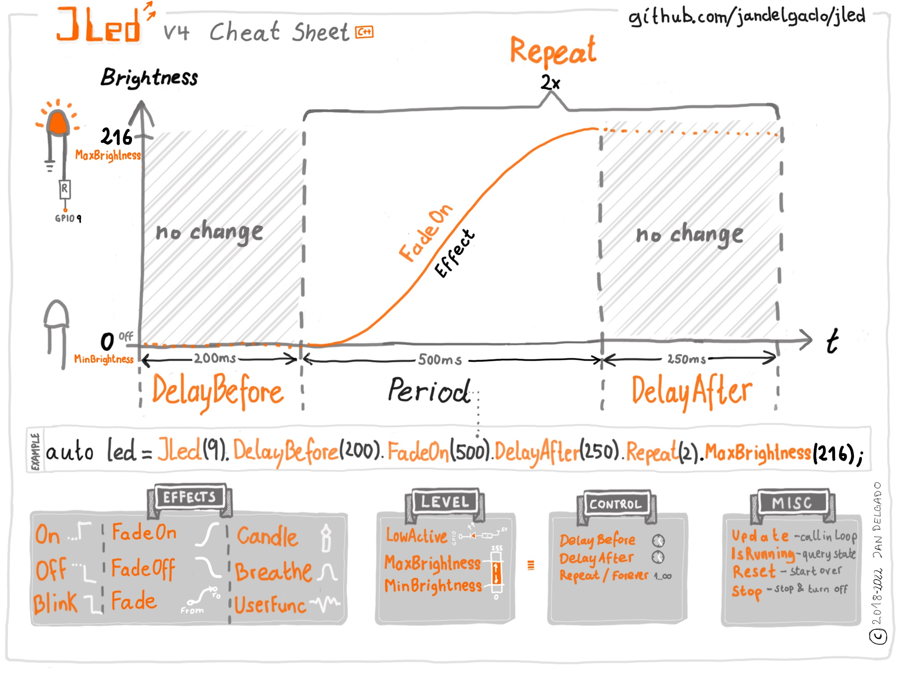

# JLed - Advanced LED Library


[](https://coveralls.io/github/jandelgado/jled?branch=master)

An embedded C++ library to control LEDs. It uses a **non-blocking** approach and can
control LEDs in simple (**on**/**off**) and complex (**blinking**,
**breathing** and more) ways in a **time-driven** manner.

JLed got some [coverage on Hackaday](https://hackaday.com/2018/06/13/simplifying-basic-led-effects/)
and someone did a [video tutorial for JLed](https://youtu.be/x5V2vdpZq1w)  - Thanks!

JLed in action | Interactive JLed playground
:-------------:|:--------------------------------------------------:
<a href="examples/multiled"></a>|<a href="https://jandelgado.github.io/jled-wasm"></a>

## Example

```c++
// breathe LED (on gpio 9) 6 times for 1500ms, waiting for 500ms after each run
#include <jled.h>

auto led_breathe = JLed(9).Breathe(1500).Repeat(6).DelayAfter(500);

void setup() { }

void loop() {
  led_breathe.Update();
}
```

## Contents

<!-- vim-markdown-toc GFM -->

* [Features](#features)
* [Cheat Sheet](#cheat-sheet)
* [Installation](#installation)
    * [Arduino IDE](#arduino-ide)
    * [PlatformIO](#platformio)
* [Usage](#usage)
    * [Effects](#effects)
        * [Static on and off](#static-on-and-off)
            * [Static on example](#static-on-example)
        * [Blinking](#blinking)
            * [Blinking example](#blinking-example)
        * [Breathing](#breathing)
            * [Breathing example](#breathing-example)
        * [Candle](#candle)
            * [Candle example](#candle-example)
        * [FadeOn](#fadeon)
            * [FadeOn example](#fadeon-example)
        * [FadeOff](#fadeoff)
        * [User provided brightness function](#user-provided-brightness-function)
            * [User provided brightness function example](#user-provided-brightness-function-example)
        * [Delays and repetitions](#delays-and-repetitions)
            * [Initial delay before effect starts](#initial-delay-before-effect-starts)
            * [Delay after effect finished](#delay-after-effect-finished)
            * [Repetitions](#repetitions)
        * [State functions](#state-functions)
            * [Update](#update)
            * [IsRunning](#isrunning)
            * [Reset](#reset)
            * [Immediate Stop](#immediate-stop)
        * [Misc functions](#misc-functions)
            * [Low active for inverted output](#low-active-for-inverted-output)
            * [Maximum brightness level](#maximum-brightness-level)
    * [Controlling a group of LEDs](#controlling-a-group-of-leds)
* [Framework notes](#framework-notes)
* [Platform notes](#platform-notes)
    * [ESP8266](#esp8266)
    * [ESP32](#esp32)
    * [STM32](#stm32)
        * [Arduino framework](#arduino-framework)
    * [Raspberry Pi Pico](#raspberry-pi-pico)
* [Example sketches](#example-sketches)
    * [PlatformIO](#platformio-1)
    * [Arduino IDE](#arduino-ide-1)
* [Extending](#extending)
    * [Support new hardware](#support-new-hardware)
* [Unit tests](#unit-tests)
* [Contributing](#contributing)
* [FAQ](#faq)
    * [How do I check if a JLed object is still being updated?](#how-do-i-check-if-a-jled-object-is-still-being-updated)
    * [How do I restart an effect?](#how-do-i-restart-an-effect)
    * [How do I change a running effect?](#how-do-i-change-a-running-effect)
* [Author and Copyright](#author-and-copyright)
* [License](#license)

<!-- vim-markdown-toc -->

## Features

* non-blocking
* effects: simple on/off, breathe, blink, candle, fade-on, fade-off, [user-defined](examples/morse) (e.g. morse)
* supports inverted  polarity of LED
* easy configuration using fluent interface
* can control groups of LEDs sequentially or in parallel
* Portable: Arduino, ESP8266, ESP32, Mbed, Raspberry Pi Pico and more platforms
  compatible, runs even in the [browser](https://jandelgado.github.io/jled-wasm)
* supports Arduino, [mbed](https://www.mbed.com) and Raspberry Pi Pico SDKs
* well [tested](https://coveralls.io/github/jandelgado/jled)

## Cheat Sheet



## Installation

### Arduino IDE

In the main menu of the Arduino IDE, select `Sketch` > `Include Library` >
`Manage Libraries...` and search for `jled`, then press `install`.

### PlatformIO

Add `jled` to your library dependencies in your `platformio.ini` project file,
e.g.

```ini
...
[env:nanoatmega328]
platform = atmelavr
board = nanoatmega328
framework = arduino
lib_deps=jled
...
```

## Usage

First, the LED object is constructed and configured, then the state is updated
with subsequent calls to the `Update()` method, typically from the `loop()`
function. While the effect is active, `Update` returns `true`, otherwise
`false`.

The constructor takes the pin, to which the LED is connected to as
the only argument. Further configuration of the LED object is done using a fluent
interface, e.g. `JLed led = JLed(13).Breathe(2000).DelayAfter(1000).Repeat(5)`.
See the examples section below for further details.

### Effects

#### Static on and off

Calling `On()` turns the LED on.  To immediately turn a LED on, make a call
like `JLed(LED_BUILTIN).On().Update()`.

`Off()` works like `On()`, except that it turns the LED off, i.e. it sets the
brightness to 0.

Use the `Set(uint8_t brightness)` method to set the brightness to the given
value, i.e. `Set(255)` is equivalent to calling `On()` and `Set(0)` is
equivalent to calling `Off()`.

Technically `Set`,  `On` and `Off` are effects with a period of 1ms that 
set the brightness to a constant value.

##### Static on example

```c++
#include <jled.h>

// turn builtin LED on after 1 second.
auto led = JLed(LED_BUILTIN).On().DelayBefore(1000);

void setup() { }

void loop() {
  led.Update();
}
```

#### Blinking

In blinking mode, the LED cycles through a given number of on-off cycles, on-
and off-cycle durations are specified independently. The `Blink()` method takes
the duration for the on- and off cycle as arguments.

##### Blinking example

```c++
#include <jled.h>

// blink internal LED every second; 1 second on, 0.5 second off.
auto led = JLed(LED_BUILTIN).Blink(1000, 500).Forever();

void setup() { }

void loop() {
  led.Update();
}
```

#### Breathing

In breathing mode, the LED smoothly changes the brightness using PWM. The
`Breathe()` method takes the period of the effect as an argument.

##### Breathing example

```c++
#include <jled.h>

// connect LED to pin 13 (PWM capable). LED will breathe with period of
// 2000ms and a delay of 1000ms after each period.
auto led = JLed(13).Breathe(2000).DelayAfter(1000).Forever();

void setup() { }

void loop() {
  led.Update();
}
```

#### Candle

In candle mode, the random flickering of a candle or fire is simulated. 
The builder method has the following signature:
  `Candle(uint8_t speed, uint8_t jitter, uin16_t period)`

* `speed` - controls the speed of the effect. 0 for fastest, increasing speed 
  divides into halve per increment. The default value is 7.
* `jitter` - the amount of jittering. 0 none (constant on), 255 maximum. Default
  value is 15.
* `period` - Period of effect in ms.  The default value is 65535 ms.

The default settings simulate a candle. For a fire effect for example use
call the method with `Candle(5 /*speed*/, 100 /* jitter*/)`. 

##### Candle example

```c++
#include <jled.h>

// Candle on LED pin 13 (PWM capable). 
auto led = JLed(13).Candle();

void setup() { }

void loop() {
  led.Update();
}
```

#### FadeOn

In FadeOn mode, the LED is smoothly faded on to 100% brightness using PWM. The
`FadeOn()` method takes the period of the effect as an argument.

The brightness function uses an approximation of this function (example with
period 1000):

[](https://www.wolframalpha.com/input/?i=plot+(exp(sin((t-1000%2F2.)*PI%2F1000))-0.36787944)*108.0++t%3D0+to+1000)


##### FadeOn example

```c++
#include <jled.h>

// LED is connected to pin 9 (PWM capable) gpio
auto led = JLed(9).FadeOn(1000).DelayBefore(2000);

void setup() { }

void loop() {
  led.Update();
}
```

#### FadeOff

In FadeOff mode, the LED is smoothly faded off using PWM. The fade starts at
100% brightness. Internally it is implemented as a mirrored version of the
FadeOn function, i.e. FadeOn(t) = FadeOff(period-t).  The `FadeOff()` method
takes the period of the effect as argument.

#### User provided brightness function

It is also possible to provide a user defined brightness evaluator. The class
must be derived from the `jled::BrightnessEvaluator` class and implement
two methods:

* `uint8_t Eval(uint32_t t) const` - the brightness evaluation function that
  calculates a brightness for the given time `t`. The brightness must be returned
  as an unsigned byte, where 0 means LED off and 255 means full brightness.
* `uint16_t Period() const` - period of the effect.

All time values are specified in milliseconds. 

The [user_func](examples/user_func) example demonstrates a simple user provided
brightness function, while the [morse](examples/morse) example shows how a more
complex application, allowing you to send morse codes (not necessarily with an
LED), can be realized.

##### User provided brightness function example

The example uses a user provided function to calculate the brightness.

```c++
class UserEffect : public jled::BrightnessEvaluator {
  public:
    uint8_t Eval(uint32_t t) const override {
        // this function changes between 0 and 255 and
        // vice versa every 250 ms.
        return 255*((t/250)%2);
    }
    // duration of effect: 5 seconds.
    uint16_t Period() const override { return 5000; }
};
```

#### Delays and repetitions

##### Initial delay before effect starts

Use the `DelayBefore()` method to specify a delay before the first effect starts.
The default value is 0 ms.

##### Delay after effect finished

Use the `DelayAfter()` method to specify a delay after each repetition of
an effect. The default value is 0 ms.

##### Repetitions

Use the `Repeat()` method to specify the number of repetitions. The default
value is 1 repetition. The `Forever()` methods sets to repeat the effect
forever. Each repetition includes a full period of the effect and the time
specified by `DelayAfter()` method.

#### State functions

##### Update

Call `Update()` periodically to update the state of the LED. `Update` returns
`true` if the effect is active, and `false` when it finished.

##### IsRunning

`IsRunning()` returns `true` if the current effect is running, else `false`.

##### Reset

A call to `Reset()` brings the JLed object to its initial state. Use it when
you want to start-over an effect.

##### Immediate Stop

Call `Stop()` to immediately turn the LED off and stop any running effects.
Further calls to `Update()` will have no effect unless the Led is reset (using
`Reset()`) or a new effect activated.

#### Misc functions

##### Low active for inverted output

Use the `LowActive()` method when the connected LED is low active. All output
will be inverted by JLed (i.e. instead of x, the value of 255-x will be set).

##### Maximum brightness level

The `MaxBrightness(uint8_t level)` method is used to set the maximum brightness 
level of the LED. A level of 255 (the default) is full brightness, while 0 
effectively turns the LED off.

The `uint_8 MaxBrightness() const` method returns the current maximum 
brightness level. Since currently only the upper 5 bits of the provided 
brighness value are used, the lower 3 bits returned are always 0.

If you want to programmatically increment or decrement the maximum brightness
level, use the `JLed::kBrightnessStep` constant (which is defined as `1 <<
(8-JLed::kBitsBrightness)` as the increment (instead of the hard wired value
`8`) to be independent of the current JLed implementation using 5 bits.

### Controlling a group of LEDs

The `JLedSequence` class allows controlling a group of `JLed` objects
simultaneously, either in parallel or sequentially, starting the next `JLed`
effect when the previous finished. The constructor takes the mode (`PARALLEL`,
`SEQUENCE`), an array of `JLed` objects and the size of the array, e.g.

```c++
JLed leds[] = {
    JLed(4).Blink(750, 250).Repeat(10),
    JLed(3).Breathe(2000).Repeat(5);
};

auto sequence = JLedSequence(JLedSequence::eMode::PARALLEL, leds).Repeat(2);

void setup() {
}

void loop() {
    sequence.Update();
}
```

Because the size of the array is known at compile time in this example, it is
not necessary to pass the array size to the constructor. A second constructor
is available in case the `JLed` array is created dynamically at runtime:
`JLed(eMode mode, JLed* leds, size_t n)`.

The `JLedSequence` provides the following methods:
* `Update()` - updates the active `JLed` objects controlled by the sequence.
  Like the `JLed::Update()` method, it returns `true` if an effect is running,
  else `false`.
* Use the `Repeat(n)` method to specify the number of repetitions. The default
  value is 1 repetition. The `Forever()` methods sets to repeat the sequence
  forever. 
* `Stop()` - turns off all `JLed` objects controlled by the sequence and 
   stops the sequence. Further calls to `Update()` will have no effect.
* `Reset()` - Resets all `JLed` objects controlled by the sequence and 
   the sequence, resulting in a start-over.

## Framework notes

JLed supports the Arduino and [mbed](https://www.mbed.org) frameworks. When
using platformio, the framework to be used is configured in the `platform.ini`
file, as shown in the following example, which for example selects the `mbed`
framework:

```ini
[env:nucleo_f401re_mbed]
platform=ststm32
board = nucleo_f401re
framework = mbed
build_flags = -Isrc 
src_filter = +<../../src/>  +<./>
upload_protocol=stlink
```

An [mbed example is provided here](examples/multiled_mbed/multiled_mbed.cpp).
To compile it for the F401RE, make your [plaform.ini](platform.ini) look like:

```ini
...
[platformio]
default_envs = nucleo_f401re_mbed
src_dir = examples/multiled_mbed
...
```

## Platform notes

### ESP8266

The DAC of the ESP8266 operates with 10 bits, every value JLed writes out gets
automatically scaled to 10 bits, since JLed internally only uses 8 bits.  The
scaling methods make sure that min/max relationships are preserved, i.e. 0 is
mapped to 0 and 255 is mapped to 1023. When using a user-defined brightness
function on the ESP8266, 8-bit values must be returned, all scaling is done by
JLed transparently for the application, yielding platform-independent code.

### ESP32

The ESP32 Arduino SDK does not provide an `analogWrite()` function. To
be able to use PWM, we use the `ledc` functions of the ESP32 SDK.
(See [esspressif documentation](https://docs.espressif.com/projects/esp-idf/en/latest/api-reference/peripherals/ledc.html) for details).

The `ledc` API connects so-called channels to GPIO pins, enabling them to use
PWM. There are 16 channels available. Unless otherwise specified, JLed
automatically picks the next free channel, starting with channel 0 and wrapping
over after channel 15. To manually specify a channel, the JLed object must be
constructed this way:

```c++
auto esp32Led = JLed(jled::Esp32Hal(2, 7)).Blink(1000, 1000).Forever();
```

The `jled::Esp32Hal(pin, chan)` constructor takes the pin number as the first
argument and the ESP32 ledc channel number on the second position. Note that
using the above-mentioned constructor yields non-platform independent code, so
it should be avoided and is normally not necessary.

### STM32

#### Arduino framework

I had success running JLed on a [STM32 Nucleo64 F401RE
board](https://www.st.com/en/evaluation-tools/nucleo-f401re.html) using this
[STM32 Arduino
core](https://github.com/rogerclarkmelbourne/Arduino_STM32/tree/master/STM32F4)
and compiling examples from the Arduino IDE. Note that the `stlink` is
necessary to upload sketches to the microcontroller.

### Raspberry Pi Pico

When using JLed on a Raspberry Pi Pico, the Pico-SDK and tools must be
installed.  The Pico supports up to 16 PWM channels in parallel. See
the [pico-demo](examples/raspi_pico) for an example and build instructions.

## Example sketches

Example sketches are provided in the [examples](examples/) directory.

* [Hello, world](examples/hello)
* [Turn LED on after a delay](examples/simple_on)
* [Breathe effect](examples/breathe)
* [Candle effect](examples/candle)
* [Fade LED on](examples/fade_on)
* [Fade LED off](examples/fade_off)
* [Controlling multiple LEDs in parallel](examples/multiled)
* [Controlling multiple LEDs in parallel (mbed)](examples/multiled_mbed)
* [Controlling multiple LEDs sequentially](examples/sequence)
* [Simple User provided effect](examples/user_func)
* [Morsecode example](examples/morse)
* [Custom HAL example](examples/custom_hal)
* [JLed compiled for WASM and running in the browser](https://jandelgado.github.io/jled-wasm)
* [Raspberry Pi Pico Demo](examples/raspi_pico)

### PlatformIO

To build an example using [the PlatformIO ide](http://platformio.org/), 
uncomment the example to be built in the [platformio.ini](platformio.ini)
project file, e.g.:

```ini
[platformio]
; uncomment example to build
src_dir = examples/hello
;src_dir = examples/breathe
```

### Arduino IDE

To build an example sketch in the Arduino IDE, select an example from
the `File` > `Examples` > `JLed` menu.

## Extending

### Support new hardware

JLed uses a very thin hardware abstraction layer (hal) to abstract access to
the actual MCU/framework used (e.g. ESP32, ESP8266). The hal object encapsulate
access to the GPIO and time functionality of the MCU under the framework being
used.  During the unit test, mocked hal instances are used, enabling tests to
check the generated output.  The [Custom HAL project](examples/custom_hal)
provides an example for a user define HAL.

## Unit tests

JLed comes with an exhaustive host-based unit test suite. Info on how to run
the host-based provided unit tests [is provided here](test/README.md).

## Contributing

* fork this repository
* create your feature branch
* add code
* add [unit test(s)](test/)
* add [documentation](README.md)
* make sure the cpp [linter](https://github.com/cpplint/cpplint) does not 
  report any problems (run `make lint`). Hint: use `clang-format` with the 
  provided [settings](.clang-format)
* commit changes
* submit a PR

## FAQ

### How do I check if a JLed object is still being updated?

* Check the return value of the `JLed::Update` method: the method returns `true` if
  the effect is still running, otherwise `false`.
* The `JLed::IsRunning` method returns `true` if an effect is running, else `false`.

### How do I restart an effect?

Call `Reset()` on a `JLed` object to start over.

### How do I change a running effect?

Just 'reconfigure' the `JLed` with any of the effect methods (e.g. `FadeOn`,
`Breathe`, `Blink` etc). Time-wise, the effect will start over.

## Author and Copyright

Copyright 2017, 2018 by Jan Delgado, jdelgado[at]gmx.net.

## License

[MIT](LICENSE)

