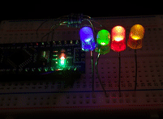
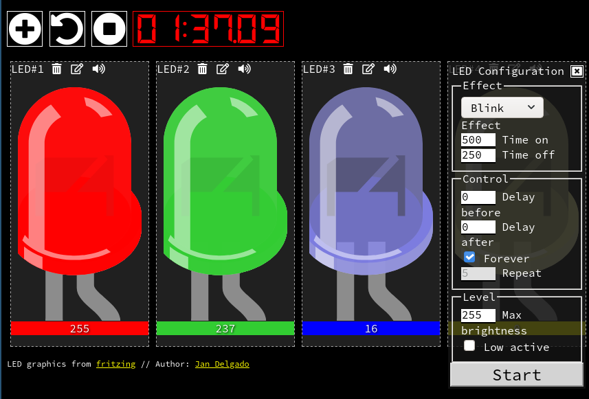
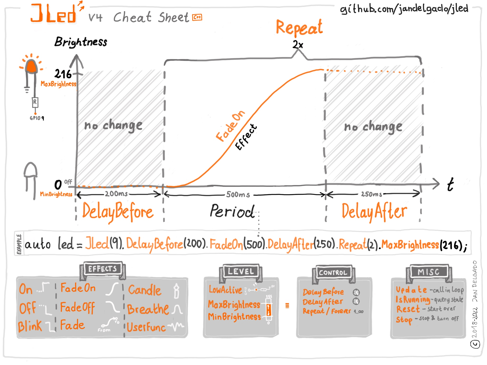
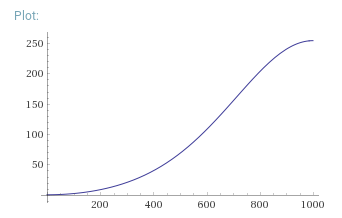
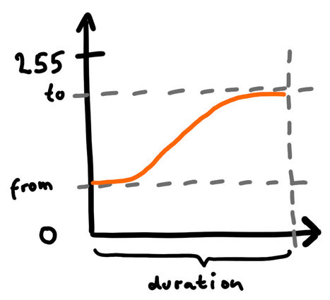

# JLed - Advanced LED Library


[](https://coveralls.io/github/jandelgado/jled?branch=master)

This is the documentation for the development version of JLed. [Find the documentation of
the latest release version here](https://jandelgado.github.io/jled)

JLed is an embedded C++ library to control LEDs. It uses a **non-blocking** approach and can
control LEDs in simple (**on**/**off**) and complex (**blinking**,
**breathing**, and more) ways in a **time-driven** manner.

JLed was featured on [Hackaday](https://hackaday.com/2018/06/13/simplifying-basic-led-effects/)
and someone made a [video tutorial for JLed](https://youtu.be/x5V2vdpZq1w). Thanks!

<b>Preferring Python?</b> Check out <a
href="https://github.com/jandelgado/jled-circuitpython">jled-circuitpython</a>, a JLed
implementation for CircuitPython and MicroPython.

<table>
 <tr>
  <th>JLed in action</th>
  <th>Interactive JLed playground</th>
 </tr>
<tr>
  <td><a href="examples/group_parallel"></a></td>
  <td><a href="https://jandelgado.github.io/jled-wasm"></a>
  </td>
 </tr>
</table>

## Example

```c++
// breathe LED (on gpio 9) 6 times for 1500ms, waiting for 500ms after each run
#include <jled.h>

auto led_breathe = JLed(9).Breathe(1500).DelayAfter(500).Repeat(6);

void setup() { }

void loop() {
  led_breathe.Update();
}
```

<!-- TOC -->

## Table of Contents

- [Features](#features)
- [Cheat Sheet](#cheat-sheet)
- [Installation](#installation)
  - [Arduino IDE](#arduino-ide)
  - [PlatformIO](#platformio)
- [Usage](#usage)
  - [JLed vs JLedHD](#jled-vs-jledhd)
  - [Output pipeline](#output-pipeline)
  - [Effects](#effects)
    - [Static on and off](#static-on-and-off)
      - [Static on example](#static-on-example)
    - [Blinking](#blinking)
      - [Blinking example](#blinking-example)
    - [Breathing](#breathing)
      - [Breathing example](#breathing-example)
    - [Candle](#candle)
      - [Candle example](#candle-example)
    - [FadeOn](#fadeon)
      - [FadeOn example](#fadeon-example)
    - [FadeOff](#fadeoff)
    - [Fade](#fade)
      - [Fade example](#fade-example)
    - [User provided brightness function](#user-provided-brightness-function)
      - [User provided brightness function example](#user-provided-brightness-function-example)
  - [Delays and repetitions](#delays-and-repetitions)
    - [Initial delay before effect starts](#initial-delay-before-effect-starts)
    - [Delay after effect finished](#delay-after-effect-finished)
    - [Repetitions](#repetitions)
  - [State functions](#state-functions)
    - [Update](#update)
    - [Lifecycle events](#lifecycle-events)
    - [IsRunning](#isrunning)
    - [Reset](#reset)
    - [Immediate Stop](#immediate-stop)
  - [Pause and Resume](#pause-and-resume)
  - [Misc functions](#misc-functions)
    - [Low active for inverted output](#low-active-for-inverted-output)
    - [Minimum- and Maximum brightness level](#minimum--and-maximum-brightness-level)
    - [WriteRaw](#writeraw)
  - [Controlling a group of LEDs](#controlling-a-group-of-leds)
    - [Group lifecycle events](#group-lifecycle-events)
    - [Reversing and bouncing a sequential group](#reversing-and-bouncing-a-sequential-group)
    - [JLedRefGroup, pointer-based groups for named LED objects](#jledrefgroup-pointer-based-groups-for-named-led-objects)
    - [When to use what?](#when-to-use-what)
- [Framework notes](#framework-notes)
- [Platform notes](#platform-notes)
  - [Resolution and the `Brightness` type](#resolution-and-the-brightness-type)
    - [`ArduinoHal` and the global `analogWriteResolution` limit](#arduinohal-and-the-global-analogwriteresolution-limit)
    - [`JLED_FORCE_ARDUINO_HAL`](#jled_force_arduino_hal)
  - [ESP8266](#esp8266)
  - [ESP32](#esp32)
    - [Using ESP-IDF](#using-esp-idf)
  - [STM32](#stm32)
    - [Arduino framework](#arduino-framework)
    - [STM32Cube (native)](#stm32cube-native)
    - [mbed framework](#mbed-framework)
  - [Raspberry Pi Pico](#raspberry-pi-pico)
- [Example sketches](#example-sketches)
  - [Building examples with PlatformIO](#building-examples-with-platformio)
  - [Building examples with the Arduino IDE](#building-examples-with-the-arduino-ide)
- [Extending](#extending)
  - [Support new hardware](#support-new-hardware)
- [Unit tests](#unit-tests)
- [Contributing](#contributing)
- [JLed 5.0 migration guide](#jled-50-migration-guide)
  - [`eStopMode` renamed to `eIdleMode`](#estopmode-renamed-to-eidlemode)
  - [JLedSequence to JLedGroup migration](#jledsequence-to-jledgroup-migration)
  - [`Update(int16_t* pLast)` removed, use `UpdateResult` now](#updateint16_t-plast-removed-use-updateresult-now)
  - [Custom brightness evaluators: `BrightnessEvaluator` is now a template](#custom-brightness-evaluators-brightnessevaluator-is-now-a-template)
  - [Custom HALs and `TJLed` subclasses: Clock and Brightness are now explicit](#custom-hals-and-tjled-subclasses-clock-and-brightness-are-now-explicit)
- [FAQ](#faq)
  - [How do I check if a JLed object is still being updated?](#how-do-i-check-if-a-jled-object-is-still-being-updated)
  - [How do I restart an effect?](#how-do-i-restart-an-effect)
  - [How do I change a running effect?](#how-do-i-change-a-running-effect)
- [Author and Copyright](#author-and-copyright)
- [License](#license)

<!-- /TOC -->

## Features

- non-blocking
- effects: simple on/off, breathe, blink, candle, fade-on, fade-off, [user-defined](examples/morse) (e.g. morse)
- high resolution (up to 16-bit) effects, if the hardware supports it with `JLedHD` (since JLed 5.0)
- supports inverted polarity of LED
- easy configuration using fluent interface
- can control groups of LEDs sequentially or in parallel
- Portable: Arduino, ESP8266, ESP32, Mbed, Raspberry Pi Pico and more platforms
  compatible, runs even in the [browser](https://jandelgado.github.io/jled-wasm)
- supports Arduino, [mbed](https://www.mbed.com), [Raspberry Pi
  Pico](https://github.com/raspberrypi/pico-sdk) and ESP32
  [ESP-IDF](https://www.espressif.com/en/products/sdks/esp-idf) SDK's
- well [tested](https://coveralls.io/github/jandelgado/jled)

## Cheat Sheet



## Installation

### Arduino IDE

In the main menu of the Arduino IDE, select `Sketch` > `Include Library` >
`Manage Libraries...` and search for `jled`, then press `install`.

### PlatformIO

Add `jled` to your library dependencies in your `platformio.ini` project file,
e.g.

```ini
...
[env:nanoatmega328]
platform = atmelavr
board = nanoatmega328
framework = arduino
lib_deps=jled
...
```

## Usage

First, the LED object is constructed and configured, then the state is updated
with subsequent calls to the `Update()` method, typically from the `loop()`
function. While the effect is active, `Update` returns `true`, otherwise
`false`. The return value is actually a richer `UpdateResult` that is also
usable as a `bool`; see [Lifecycle events](#lifecycle-events) for the full API.

The constructor takes the pin, to which the LED is connected to as
the only argument. Further configuration of the LED object is done using a fluent
interface, e.g. `auto led = JLed(13).Breathe(2000).DelayAfter(1000).Repeat(5)`.
See the examples section below for further details.

### JLed vs JLedHD

`JLed` uses 8-bit brightness internally (`uint8_t`, 0-255), while `JLedHD` ("high-definition")
uses 16-bit (`uint16_t`, 0-65535). Both share the same API and effects.

Use `JLedHD` on long fade or breathe effects where the 256 discrete steps of `JLed` can
produce visible "staircase" banding, especially at low brightness. `JLedHD` eliminates this by
giving the HAL up to 65536 values to work with. The HAL then maps them to the native PWM
resolution of the platform (e.g. 13-bit on ESP32, 16-bit on Pico/Teensy).

Use `JLed` for simple on/off, blink or fast fade/breathe effects. Here the extra resolution buys
usually nothing, and 8-bit uses half the memory per brightness value. Also note that on some
platforms (see the table below) `JLed` and `JLedHD` resolve to the same HAL width (e.g. standard
8-bit Arduino boards), so `JLedHD` has no practical benefit there.

> **Note:** You cannot mix `JLed` and `JLedHD` objects in the same sketch when both map to
> `ArduinoHal` with _different_ bit widths, because `analogWriteResolution()` is a global
> setting. See the [`ArduinoHal` note](#arduinohal-and-the-global-analogwriteresolution-limit)
> below.

### Output pipeline

First the configured effect (e.g. `Fade`) is evaluated for the current time
`t`. JLed internally uses either 8-bit (`JLed`, `uint8_t`, 0-255) or 16-bit
(`JLedHD`, `uint16_t`, 0-65535) values to represent brightness. Next, the value
is scaled to the limits set by `MinBrightness` and `MaxBrightness` (if set).
When the effect is configured for a low-active LED using `LowActive`, the
brightness value will be inverted. Finally the value is passed to the hardware
abstraction, which scales it to the native PWM resolution of the platform (e.g.
13 bits for ESP32 `JLedHD`, 16 bits for Pico `JLedHD`). The brightness value is
then written out to the configured GPIO.

```text
+---------+    +---------+    +---------+    +---------+    +-------+
|Evaluate |    |Scale to |    |Optional |    |Scale for|    |Write  |
|effect(t)|--->|[min,max]|--->|Invert   |--->|Harware  |--->|to GPIO|
+---------+    +---------+    +---+-----+    +---------+    +-------+
```

### Effects

#### Static on and off

Calling `On(uint16_t period=1)` turns the LED on. To immediately turn a LED on,
make a call like `JLed(LED_BUILTIN).On().Update()`. The `period` is optional
and defaults to 1ms.

`Off()` works like `On()`, except that it turns the LED off, i.e., it sets the
brightness to 0.

Use the `Set(Brightness brightness, uint16_t period=1)` method to set the
brightness to a specific value. The type of `brightness` depends on the
instantiation: `uint8_t` (0-255) for `JLed`, and `uint16_t` (0-65535) for
`JLedHD`. For example, `Set(255)` is equivalent to calling `On()` and `Set(0)`
is equivalent to calling `Off()` when using `JLed`; with `JLedHD` the full
range is `Set(65535)` for full brightness.

To write brightness values that work with both `JLed` and `JLedHD` without
change, use `jled::Percentage` or the `_pct` user-defined literal (requires
`using jled::operator""_pct`). `Percentage` converts implicitly to the correct
range for whichever brightness type is active:

```c++
using jled::operator""_pct;

JLed   led   = JLed(13)  .Set(75_pct);  // 75 % of 255  → 191
JLedHD ledHD = JLedHD(13).Set(75_pct);  // 75 % of 65535 → 49151
// Equivalent explicit form:
JLed   led2  = JLed(13)  .Set(jled::Percentage(75));
```

Technically, `Set`, `On` and `Off` are effects with a default period of 1ms, that
set the brightness to a constant value. Specifying a different period has an
effect on when the `Update()` method will be done updating the effect and
return false (like for any other effects). This is important when for example
in a `JLedGroup` the LED should stay on for a given amount of time.

##### Static on example

```c++
#include <jled.h>

// turn builtin LED on after 1 second.
auto led = JLed(LED_BUILTIN).On().DelayBefore(1000);

void setup() { }

void loop() {
  led.Update();
}
```

#### Blinking

In blinking mode, the LED cycles through a given number of on-off cycles, on-
and off-cycle durations are specified independently. The `Blink()` method has three
parameters `duration_on`, `duration_off` and `n`, the number of on-off cycles, which
defaults to 1. For the effect to work correctly, the following must hold true:
`0 < (duration_on+duration_off)*n <= 65535`.

##### Blinking example

```c++
#include <jled.h>

// blink internal LED 3 times: 250ms on, 500ms off. Then wait 1000ms. Repeat forever.
auto led = JLed(LED_BUILTIN).Blink(250, 500, 3).DelayAfter(1000).Forever();

void setup() { }

void loop() {
  led.Update();
}
```

#### Breathing

In breathing mode, the LED smoothly changes the brightness using PWM. The
`Breathe()` method takes the period of the effect as an argument.

##### Breathing example

```c++
#include <jled.h>

// connect LED to pin 13 (PWM capable). LED will breathe with period of
// 2000ms and a delay of 1000ms after each period.
auto led = JLed(13).Breathe(2000).DelayAfter(1000).Forever();

void setup() { }

void loop() {
  led.Update();
}
```

It is also possible to specify fade-on, on- and fade-off durations for the
breathing mode to customize the effect.

```c++
// LED will fade-on in 500ms, stay on for 1000ms, and fade-off in 500ms.
// It will delay for 1000ms afterwards and continue the pattern.
auto led = JLed(13).Breathe(500, 1000, 500).DelayAfter(1000).Forever();
```

#### Candle

In candle mode, the random flickering of a candle or fire is simulated.
The builder method has the following signature:
`Candle(uint8_t speed, uint8_t jitter, uint16_t period, uint16_t offset)`

- `speed` - controls the speed of the effect. 0 for fastest, increasing speed
  divides into halve per increment. The default value is 6.
- `jitter` - the amount of jittering. 0 none (constant on), 255 maximum. Default
  value is 15.
- `period` - Period of effect in ms. The default value is 65535 ms.
- `offset` - a time offset in ms. By default each LED derives its offset from its
  own memory address, so multiple LEDs with the same parameters automatically
  flicker independently without any configuration. Pass 0 to have all LEDs run
  in sync, or any other value to set a specific pattern.

The default settings simulate a candle. For a fire effect for example
call the method with `Candle(5 /*speed*/, 100 /* jitter*/)`.

##### Candle example

```c++
#include <jled.h>

// Candle on LED pin 13 (PWM capable).
auto led = JLed(13).Candle();

void setup() { }

void loop() {
  led.Update();
}
```

#### FadeOn

In FadeOn mode, the LED is smoothly faded on to 100% brightness using PWM. The
`FadeOn()` method takes the period of the effect as an argument.

The brightness function uses an approximation of this function (example with
period 1000):

[](<https://www.wolframalpha.com/input/?i=plot+(exp(sin((t-1000%2F2.)*PI%2F1000))-0.36787944)*108.0++t%3D0+to+1000>)

##### FadeOn example

```c++
#include <jled.h>

// LED is connected to pin 9 (PWM capable) gpio
auto led = JLed(9).FadeOn(1000).DelayBefore(2000);

void setup() { }

void loop() {
  led.Update();
}
```

#### FadeOff

In FadeOff mode, the LED is smoothly faded off using PWM. The fade starts at
100% brightness. Internally it is implemented as a mirrored version of the
FadeOn function, i.e., FadeOff(t) = FadeOn(period-t). The `FadeOff()` method
takes the period of the effect as argument.

#### Fade

The Fade effect allows to fade from any start value `from` to any target value
`to` with the given duration. Internally it sets up a `FadeOn` or `FadeOff`
effect and `MinBrightness` and `MaxBrightness` values properly. The `Fade`
method take three arguments: `from`, `to` and `duration`.

<a href="examples/fade_from_to"></a>

##### Fade example

```c++
#include <jled.h>

// fade from 100 to 200 with period 1000
auto led = JLed(9).Fade(100, 200, 1000);

void setup() { }

void loop() {
  led.Update();
}
```

#### User provided brightness function

It is also possible to provide a user defined brightness evaluator. The class must be derived from
the `jled::BrightnessEvaluator<Brightness>` template class and implement two methods:

- `Brightness Eval(jled::period_t t) const` - the brightness evaluation function that
  calculates a brightness for the given time `t` (`t` is always in `[0, Period())`, and
  `period_t` is `uint16_t`). The brightness must be returned as an unsigned byte, where 0
  means LED off and 255 means full brightness if `Brightness` is `uint8_t` and as an
  unsigned int between 0 and 65535 if `Brightness` is `uint16_t`.
- `uint16_t Period() const` - period of the effect.

All time values are specified in milliseconds.

The [user_func](examples/user_func) example demonstrates a simple user provided
brightness function, while the [morse](examples/morse) example shows how a more
complex application, allowing you to send morse codes (not necessarily with an
LED), can be realized.

##### User provided brightness function example

The example shows how to implement a user defined effect that works both with `JLed` and
`JLedHD`

```c++
template<typename Brightness>
class UserEffect : public jled::BrightnessEvaluator<Brightness> {
  public:
    Brightness Eval(jled::period_t t) const override {
        // this function changes between OFF and ON  every 250 ms.
        return jled::BrightnessTraits<Brightness>::kFullBrightness*((t/250)%2);
    }
    // duration of effect: 5 seconds.
    uint16_t Period() const override { return 5000; }
};
```

### Delays and repetitions

#### Initial delay before effect starts

Use the `DelayBefore()` method to specify a delay before the first effect starts.
The default value is 0 ms.

#### Delay after effect finished

Use the `DelayAfter()` method to specify a delay after each repetition of
an effect. The default value is 0 ms.

#### Repetitions

Use the `Repeat()` method to specify the number of repetitions. The default
value is 1 repetition. The `Forever()` method sets to repeat the effect
forever. Each repetition includes a full period of the effect and the time
specified by `DelayAfter()` method. Use `IsForever()` to query whether the
effect is set to repeat forever.

### State functions

#### Update

Call `Update()` or `Update(uint32_t t)` to periodically update the state of
the LED. `Update()` is a shortcut to call `Update(uint32_t t)` with the
current time in milliseconds.

`Update()` returns an `UpdateResult`, which is usable directly as a `bool`:
`true` while the effect is active, `false` once it finished.

`UpdateResult` also carries the brightness value written to the LED this
tick:

```c++
auto r = led.Update();
if (r.HasBrightness()) {
    // the LED was updated with the brightness value now stored in r.Brightness()
    auto lastVal = r.Brightness();
    ...
}
```

See [last_brightness](examples/last_brightness) example for a working example.

Beyond brightness, `UpdateResult` exposes lifecycle events, see
[Lifecycle events](#lifecycle-events) below.

#### Lifecycle events

`UpdateResult` also reports which phase transitions happened on this
`Update()` call, so you can react inline instead of polling the return value
and tracking state yourself:

These are **inspected per `Update()` call**, not registered once: you re-attach
the callbacks (or read the predicates) on the `UpdateResult` each time you call
`Update()` in your loop. There is no stored handler, and a bare `Update()` with
no callbacks costs nothing beyond the small `UpdateResult` value it returns.

Each event has both a predicate (`Is<Event>()`, a state query answering "did this
happen on this tick?") and a fluent callback (an `On<Event>(cb)` event hook). The
two spell the same event slightly differently by design: `IsStarted()` pairs with
`OnStart()`, `IsRepeatStarted()` with `OnRepeatStart()`, `IsEnteringDelayAfter()`
with `OnEnterDelayAfter()`.

| Query                    | Fires when                                                                   |
| ------------------------ | ---------------------------------------------------------------------------- |
| `IsStarted()`            | once per run, on the first `Update()` call (or the first after `Reset()`)    |
| `IsFirstOutput()`        | once per run, on the first actual output tick                                |
| `IsRepeatStarted()`      | once per repetition, including the first                                     |
| `IsEnteringDelayAfter()` | once per repetition that has a `DelayAfter()`, on entry to that phase        |
| `IsDone()`               | once, when the effect stops: all repetitions complete, or `Stop()` is called |

More than one of these can be true on the same `Update()` call. E.g., an
effect with the default `duration = 1` (as used by `On()`, `Off()` and
`Set()`) starts and finishes on its one and only call, so `IsStarted()`,
`IsFirstOutput()`, `IsRepeatStarted()` and `IsDone()` are all `true` together.

Each event also has a matching fluent callback, so you can react at the call
site without an `if`:

```c++
led.Update()
    .OnStart([](JLed& l) { Serial.println("started"); })
    .OnFirstOutput([](JLed& l) { Serial.println("first output"); })
    .OnRepeatStart([](JLed& l) { Serial.println("iteration"); })
    .OnEnterDelayAfter([](JLed& l) { l.MaxBrightness(64); })
    .OnDone([](JLed& l) { l.Reset(); });
```

Callbacks are template parameters ([lambdas](https://en.cppreference.com/cpp/language/lambda) or
function pointers) and they run synchronously inline, in the order chained.

Common patterns:

```c++
// turn led off when effect is done, regardless of last state
void loop() {
    led.Update().OnDone([](JLed& l) { l.WriteRaw(0); });
}

// turn led off when in the delay-after phase
void loop() {
    led.Update().OnEnterDelayAfter([](JLed& l) { l.WriteRaw(0); });
}

// turn second LED led2 on, if led is in delay-after phase, else it is off
void loop() {
    led.Update().OnRepeatStart([](JLed&) { led2.On().Update(); });
                .OnEnterDelayAfter([](JLed& l) { led2.Off().Update(); });
}
```

#### IsRunning

`IsRunning()` returns `true` if the current effect is running, else `false`.

#### Reset

A call to `Reset()` brings the JLed object to its initial state. Use it when
you want to start-over an effect.

#### Immediate Stop

Call `Stop()` to immediately turn the LED off and stop any running effects.
Further calls to `Update()` will have no effect, unless the Led is reset using
`Reset()` or a new effect is activated. By default, `Stop()` sets the current
brightness level to `MinBrightness`.

`Stop()` takes an optional argument `mode` of type `JLed::eStopMode`:

- if set to `JLed::eStopMode::KEEP_CURRENT`, the LEDs current level will be kept
- if set to `JLed::eStopMode::FULL_OFF` the level of the LED is set to `0`,
  regardless of what `MinBrightness` is set to, effectively turning the LED off
- if set to `JLed::eStopMode::TO_MIN_BRIGHTNESS` (default behavior), the LED
  will set to the value of `MinBrightness`

```c++
// stop the effect and set the brightness level to 0, regardless of min brightness
led.Stop(JLed::eStopMode::FULL_OFF);
```

### Pause and Resume

Call `Pause()` to freeze the current effect. While paused, `Update()` returns `true` but
does not advance the effect. Call `Resume()` to continue from the exact point where it was
paused. `IsPaused()` returns `true` while the effect is frozen.

`Pause()` accepts an optional `mode` argument of type `jled::eIdleMode` (same values as
`Stop()`) that controls the LED's brightness during the pause. The default is
`jled::eIdleMode::TO_MIN_BRIGHTNESS`, which sets the LED to its configured minimum
brightness. Use `jled::eIdleMode::KEEP_CURRENT` to hold the last rendered value, or
`jled::eIdleMode::FULL_OFF` to force the LED off regardless of `MinBrightness`.

Pausing before an effect has started is valid, the effect will not start until
`Resume()` is called.

```c++
auto led = JLed(9).Breathe(2000).Forever();

void loop() {
  if (buttonPressed()) {
    if (led.IsPaused()) {
      led.Resume();
    } else {
      led.Pause();
    }
  }
  led.Update();
}
```

`JLedGroup` also supports `Pause()` and `Resume()`, which propagate to all member LEDs so
the entire group freezes and resumes in sync.

### Misc functions

#### Low active for inverted output

Use the `LowActive()` method when the connected LED is low active (common anode). All output
will be inverted then. Call `LowActive(false)` to switch back to normal (high active) output.
Use `IsLowActive()` to query whether the LED is configured as low active.

Inversion is performed by the HAL layer: on Raspberry Pi Pico, and on ESP32 with ESP-IDF
≥ 4.4, it is done in hardware (a PWM-CSR polarity bit / the LEDC driver's `output_invert`
flag is set when `LowActive()` is called). `InvertableHal` is a software fallback
used on ESP-IDF < 4.4 and every other bundled platform.

#### Minimum- and Maximum brightness level

The `MaxBrightness(Brightness level)` method is used to set the maximum
brightness level of the LED, where `Brightness` is `uint8_t` for `JLed` and
`uint16_t` for `JLedHD`. A level of full brightness (255 / 65535, the default)
is maximum output, while 0 effectively turns the LED off. In the same way, the
`MinBrightness(Brightness level)` method sets the minimum brightness level. The
default minimum level is 0. If minimum or maximum brightness levels are set,
the output value is scaled to be within the interval defined by
`[minimum brightness, maximum brightness]`: a value of 0 will be mapped to the
minimum brightness level, and a value of full brightness will be mapped to the
maximum brightness level.

To specify levels independently of the brightness type, use `jled::Percentage`
or the `_pct` literal (e.g., `led.MaxBrightness(50_pct);`).

The `Brightness MaxBrightness() const` method returns the current maximum
brightness level. `Brightness MinBrightness() const` returns the current
minimum brightness level.

#### WriteRaw

`WriteRaw(val)` writes a brightness value directly to the hardware, applying
`LowActive()` inversion the same way effects normally do, but bypassing the
effect state machine entirely. It does not touch the effect configuration
or any other JLed state. Use it from a lifecycle callback to force an output
that the effect itself would not produce, e.g. turning the LED off during
the `DelayAfter()` phase, which otherwise holds the last computed brightness
for its whole duration:

```c++
JLed led = JLed(LED_BUILTIN).FadeOn(500).DelayAfter(1000).Repeat(5);

void loop() {
    led.Update().OnEnterDelayAfter([](JLed& l) { l.WriteRaw(0); });
}
```

Since `WriteRaw()` leaves the effect configuration untouched, the next
repetition's `FadeOn()` runs unaffected.

### Controlling a group of LEDs

The `JLedGroup` class controls an array of LEDs of one concrete type, in parallel or
sequentially, written inline:

```c++
JLed leds[] = {JLed(4).Blink(750, 250).Repeat(2),
               JLed(3).Breathe(2000),
               JLed(5).FadeOff(1000).Repeat(2)};

auto group = JLedGroup::Parallel(leds).Repeat(5);

void setup() { }

void loop() {
    group.Update();
}
```

Use the static factory methods `JLedGroup::Parallel(leds)` and
`JLedGroup::Sequential(leds)` to create a group. The array size is deduced
automatically. A runtime-size overload is also available:
`JLedGroup::Parallel(leds, n)`. `JLedGroup` provides the following methods:

- `Update()` - updates all elements. Returns a `GroupUpdateResult`, usable
  directly as a `bool`: `true` while the group is running, `false` once it
  has finished. Also exposes `IsStarted()`/`IsDone()` and
  `OnStart()`/`OnDone()` for group-level lifecycle events, see
  [Group lifecycle events](#group-lifecycle-events) below.
- `Repeat(n)` - plays the group `n` times. Default is 1.
- `Forever()` - plays the group indefinitely.
- `Stop(mode = jled::eIdleMode::TO_MIN_BRIGHTNESS)` - stops all elements
  immediately. `mode` controls the final brightness of each LED, identical to
  [`JLed::Stop(mode)`](#immediate-stop). Further calls to `Update()` have no effect.
- `Reset()` - resets all elements and restarts the group from the beginning
  (the beginning of the currently configured direction, see below). Fluent:
  returns `JLedGroup&`.
- `Reverse()` - toggles sequential playback direction. `Sequential` mode only and a
  no-op in `Parallel` mode. See
  [Reversing and bouncing a sequential group](#reversing-and-bouncing-a-sequential-group).
- `Skip()` - advances the sequence cursor by one step in the current
  direction without playing the skipped element. `Sequential` mode only, a no-op
  in `Parallel` mode.
- `IsReversed()` - current playback direction, `false` is forward (the
  default).

`JLedHDGroup` is the `JLedHD` equivalent of `JLedGroup`. A user-defined LED type
needs just a matching alias:

```c++
using MyLedGroup = TJLedGroup<JLedClockType, MyLedType>;
```

Mixing different LED types (resolutions, nested groups, user-defined types) in one group needs
[`JLedRefGroup`](#jledrefgroup-pointer-based-groups-for-named-led-objects), see
[When to use what?](#when-to-use-what) below.

#### Group lifecycle events

`GroupUpdateResult` is returned by the `Update()` method of the group and reports
these group-level events, analogous to `JLed`'s
[Lifecycle events](#lifecycle-events) but scoped to the group as a whole:

| Query               | Fires when                                                                                                                                                                                                                                                     |
| ------------------- | -------------------------------------------------------------------------------------------------------------------------------------------------------------------------------------------------------------------------------------------------------------- |
| `IsStarted()`       | once per run, on the first `Update()` call (or the first after `Reset()`)                                                                                                                                                                                      |
| `IsDone()`          | once, when the group finishes: all repetitions exhausted, or `Stop()` is called                                                                                                                                                                                |
| `IsRepeatStarted()` | once per repetition, including the first: coincides with `IsStarted()` on the first, and fires again each time a full pass through the group completes and another repetition follows (`Repeat(n>1)`/`Forever()`). Independent of `Parallel`/`Sequential` mode |
| `IsElementEnter()`  | `Sequential` groups only: an element became active this tick, the first element on start or the next element on a handoff. Never fires in `Parallel` mode                                                                                                      |
| `IsElementLeave()`  | `Sequential` groups only: an element stopped being active this tick, on a handoff to the next element or when the last element finishes. Never fires in `Parallel` mode                                                                                        |

An empty group (no elements) fires `IsStarted()`, `IsRepeatStarted()` and `IsDone()` together on its
one and only `Update()` call. `IsElementEnter()`/`IsElementLeave()` do not fire there, since there is
no element to enter or leave. They are a `Sequential` mode concept and never fire in `Parallel` mode either,
where all elements move together and there is no single-element handoff: use `OnStart()`/`OnDone()`
there instead. Each event has a matching fluent callback. `OnElementEnter`/`OnElementLeave`
additionally pass the 0-based index of the element (into the array given to `Sequential()`) and a
reference to the element itself, so you can act on it directly:

```c++
JLed leds[] = {JLed(4).Blink(750, 250), JLed(3).Breathe(2000)};
auto group = JLedGroup::Sequential(leds);

group.Update()
    .OnStart([](JLedGroup&) { Serial.println("group started"); })
    .OnRepeatStart([](JLedGroup&) { Serial.println("repetition begins"); })
    .OnElementLeave([](JLedGroup&, uint8_t idx, JLed&) {
        Serial.print("leave: ");
        Serial.println(idx);
    })
    .OnElementEnter([](JLedGroup&, uint8_t idx, JLed& led) {
        Serial.print("enter: ");
        Serial.println(idx);
        led.MaxBrightness(64);
    })
    .OnDone([](JLedGroup&) { Serial.println("group finished"); });
```

`idx` is the 0-based position in the `leds` array, so `0` is `led1`, `1` is `led2`. `OnElementLeave`
fires once for `led1` (handing off to `led2`) and once more for `led2` (the group finishing).

#### Reversing and bouncing a sequential group

`Reverse()` toggles the playback direction on a `Sequential` group. It takes no argument
so calling it repeatedly, e.g. once per `OnDone`, naturally alternates
direction pass over pass.

Composing `Reverse()`, `Reset()` and `Skip()` from `OnDone` is the idiomatic recipe for continuous
ping-pong effects. `OnDone`'s callback runs again every time a pass finishes, so as long as
something keeps calling `Update()`, it keeps alternating direction forever:

```c++
group.Update().OnDone([](JLedGroup& g) { g.Reverse().Reset().Skip(); });
// a, b, c, d  ->  c, b, a  ->  b, c, d  ->  c, b, a  ->  ...
```

For "play once, then backward once, then stop", just add a guard to only reverse once in
`OnDone`:

```c++
bool bounced = false;
...
group.Update().OnDone([&bounced](JLedGroup& g) {
    if (bounced) return;
    bounced = true;
    g.Reverse().Reset().Skip();
});
// a, b, c, d  ->  c, b, a  ->  (stays stopped)
```

`Skip()` drops the reprise of the element the direction just reversed away from, which
would otherwise play twice: once as the last element of the pass that just finished, once
again as the first element of the naive next pass. Omitting `.Skip()` is a valid, deliberate
choice for callers who want the duplicated endpoint:

```c++
group.Update().OnDone([](JLedGroup& g) { g.Reverse().Reset(); });
// a, b, c, d, d, c, b, a, a, b, c, d, ...
```

See the [Cylon/Larson scanner example](examples/group_reverse/) for a complete example.

#### JLedRefGroup, pointer-based groups for named LED objects

`JLedRef` and `JLedRefGroup` reference externally managed LED objects by pointer instead of
storing them by value, and are the way to build a group that mixes LED types. Each `JLedRef` slot
stores only a pointer to the LED and a shared vtable pointer (8 bytes on 32-bit, 4 bytes on 8-bit
AVR). The tradeoff is ergonomics: LED objects must be declared as named variables, anonymous
inline construction is not possible.

```c++
auto led1 = JLed(4).Blink(750, 250).Repeat(2);
auto led2 = JLedHD(3).Breathe(2000);

JLedRef refs[] = {&led1, &led2};
auto group = JLedRefGroup::Parallel(refs);
```

Nested groups work the same way, declare the inner group as a named variable and take its address:

```c++
auto inner0 = JLed(5).Blink(250, 250).Repeat(2);
auto inner1 = JLedHD(6).FadeOn(1000);
JLedRef inner_refs[] = {&inner0, &inner1};
auto innerGroup = JLedRefGroup::Parallel(inner_refs);

auto led0 = JLed(4).Blink(750, 250).Repeat(2);
auto led1 = JLedHD(3).Breathe(2000);
JLedRef leds[] = {&led0, &led1, &innerGroup};
auto group = JLedRefGroup::Sequential(leds);
```

`IsStarted()`/`IsDone()`/`IsRepeatStarted()` on `group` still work even though one of its elements
is itself a group. `OnElementEnter`/ `OnElementLeave` will fire for `group`'s own direct elements,
so `inner0`/`inner1` entering or leaving inside `innerGroup` is invisible to `group`'s callbacks.

`JLedRef` accepts pointers to `JLed`, `JLedHD`, `JLedGroup`, `JLedRefGroup`, or any user-defined
`TJLed` subclass. Mixed types work without any extra syntax, the array element type is declared as
`JLedRef` and the compiler applies the implicit conversion per element.

On `JLedRefGroup`, whose elements may be of different types, the reference passed to callbacks
is a `TJLedRef&`. You need to recover the concrete type it was constructed from with
`element.As<T>()`, which returns `T*`, or `nullptr` if the element isn't exactly that type:

```c++
auto led1 = JLed(4).Blink(750, 250).Repeat(2);
auto led2 = JLedHD(3).Breathe(2000);
JLedRef refs[] = {&led1, &led2};
auto group = JLedRefGroup::Sequential(refs);

group.Update().OnElementEnter([](JLedRefGroup&, uint8_t idx, JLedRef& e) {
    if (auto* l = e.As<JLed>()) l->MaxBrightness(64);   // l points to led1
});
```

> **Lifetime:** LED objects must outlive the `JLedRef` / `JLedRefGroup` that
> references them. Do not create `JLedRef` from temporaries.

#### When to use what?

> `JLedGroup` groups LEDs of one kind, written inline.
> `JLedRefGroup` groups anything, at the price of naming the variables.

Reach for `JLedRefGroup` when:

- you need to mix LED types in one group: different resolutions (`JLed`/`JLedHD`), nested
  groups, or a user-defined `TJLed` type
- you want to keep your LEDs as named variables anyway, because you also want to reach them from
  elsewhere in your sketch, or because you want to poll them individually
- you want to build the group from LEDs that are declared in different places

## Framework notes

JLed supports the Arduino and [mbed](https://www.mbed.org) frameworks, as well as native
Pico-SDK, ESP-IDF and STM32Cube builds without any framework at all (see the [Raspberry Pi
Pico](#raspberry-pi-pico), [ESP32](#esp32) and [STM32](#stm32) sections). When
using PlatformIO, the framework to be used is configured in the `platformio.ini`
file, as shown in the following example, which for example selects the `mbed`
framework:

```ini
[env:nucleo_f401re_mbed]
platform=ststm32
board = nucleo_f401re
framework = mbed
upload_protocol=stlink
```

An [mbed example is provided here](examples/mbed_demo/mbed_demo.cpp).
To compile it for the F401RE, make your [platformio.ini](platformio.ini) look like:

```ini
...
[platformio]
default_envs = nucleo_f401re_mbed
src_dir = examples/mbed_demo
...
```

## Platform notes

### Resolution and the `Brightness` type

JLed calculates all effects in either **8-bit** precision (`uint8_t`, used by `JLed`) or
**16-bit** precision (`uint16_t`, used by `JLedHD`). Before writing to hardware, the value is
scaled from the internal precision to the native PWM resolution of the HAL. This scaling is
performed by a single bit-shift and is zero-cost when source and target resolutions are
identical (e.g. 8-bit internal → 8-bit HAL, or 16-bit internal → 16-bit HAL).

To specify brightness values that work transparently with both `JLed` and `JLedHD` without
any code changes, use `Percentage` or the `_pct` user-defined literal:

```c++
using jled::operator""_pct;

JLed   led   = JLed(13)  .MaxBrightness(75_pct).Breathe(500);  // 75 % of 255
// or ...
JLedHD led16 = JLedHD(13).MaxBrightness(75_pct).Breathe(500);  // 75 % of 65535
// Both of the above are equivalent to: .MaxBrightness(jled::Percentage(75))
```

The following table shows the HAL and native PWM resolution used by `JLed` and `JLedHD` on
each supported platform:

| Platform                                                | `JLed`                    | `JLedHD`                  |
| ------------------------------------------------------- | ------------------------- | ------------------------- |
| ESP32 (default)                                         | `Esp32Hal<8>` (8-bit)     | `Esp32Hal<13>` (13-bit)   |
| Raspberry Pi Pico (default)                             | `PicoHal<8>` (8-bit)      | `PicoHal<16>` (16-bit)    |
| mbed                                                    | `MbedHal<8>` (8-bit)      | `MbedHal<16>` (16-bit)    |
| Teensy 4.x / 3.x / LC                                   | `ArduinoHal<8>` (8-bit)   | `ArduinoHal<16>` (16-bit) |
| SAMD21 (Arduino Zero, MKR series) / Arduino Due         | `ArduinoHal<8>` (8-bit)   | `ArduinoHal<12>` (12-bit) |
| STM32 (STM32duino)                                      | `ArduinoHal<12>` (12-bit) | `ArduinoHal<12>` (12-bit) |
| nRF5 (Nordic)                                           | `ArduinoHal<8>` (8-bit)   | `ArduinoHal<12>` (12-bit) |
| RP2040 arduino-pico SDK (with `JLED_FORCE_ARDUINO_HAL`) | `ArduinoHal<8>` (8-bit)   | `ArduinoHal<16>` (16-bit) |
| ESP8266 Arduino core v1/v2                              | `ArduinoHal<10>` (10-bit) | `ArduinoHal<10>` (10-bit) |
| ESP8266 Arduino core v3+                                | `ArduinoHal<8>` (8-bit)   | `ArduinoHal<10>` (10-bit) |
| All other Arduino-compatible platforms                  | `ArduinoHal<8>` (8-bit)   | `ArduinoHal<8>` (8-bit)   |

Internally, `JLed` performs all effect calculations in 8-bit arithmetic (`uint8_t`). The result
is passed directly to the HAL, which writes it via `analogWrite` using 8-bit resolution.

`JLedHD` performs the same calculations in 16-bit arithmetic (`uint16_t`), giving 256× finer
intermediate values. If the platform's native PWM resolution is lower than 16 bits (e.g. 13-bit
on ESP32), the HAL scales the value to fit: a 16-bit brightness of 65535 becomes
8191 in 13-bit space. No precision is fabricated, the extra bits simply allow the effect
evaluator to express smoother transitions before the final hardware mapping is applied.

#### `ArduinoHal` and the global `analogWriteResolution` limit

`ArduinoHal` uses Arduino's
[analogWriteResolution()](https://docs.arduino.cc/language-reference/en/functions/analog-io/analogWriteResolution/) function
to configure the PWM resolution, which is a **global, sketch-wide setting** that applies to every PWM
pin at once. As a consequence, you currently **cannot mix** `JLed` (8-bit) and `JLedHD` objects in the same
sketch when both resolve to `ArduinoHal` with different bit widths. The last
`analogWriteResolution()` call wins and silently misconfigures the other instances. This affects all
platforms where `JLed` and `JLedHD` resolve to different bit widths: Teensy (16-bit), SAMD21 / Arduino
Due / nRF5 (12-bit `JLedHD` vs 8-bit `JLed`), ESP8266 core v3+ (`JLed` 8-bit vs `JLedHD` 10-bit), and
RP2040 via arduino-pico (16-bit). On all remaining Arduino-compatible platforms both types share the
same resolution (STM32duino where both are 12-bit, ESP8266 core v1/v2 where both are 10-bit), so
mixing is safe.

#### `JLED_FORCE_ARDUINO_HAL`

Define `JLED_FORCE_ARDUINO_HAL` (e.g. via `build_flags` in `platformio.ini`) to bypass the
native Pico-SDK and ESP32 HALs and fall back to the generic `ArduinoHal`. This is useful
when targeting those platforms through the Arduino framework rather than the native SDK, or
for debugging purposes.

```ini
[env:my_board]
platform = ...
build_flags = -DJLED_FORCE_ARDUINO_HAL
```

When `JLED_FORCE_ARDUINO_HAL` is set on an RP2040 board, `JLedHD` maps to
`ArduinoHal<16>` (Earle Philhower arduino-pico SDK) instead of `PicoHal<16>`, subject to
the global `analogWriteResolution` constraint described above. On ESP32, the flag falls
back to `ArduinoHal<8>` for both `JLed` and `JLedHD`, so they share the same resolution
and can be mixed freely.

### ESP8266

The ESP8266 PWM peripheral supports up to 10-bit resolution. On Arduino core v1/v2 both `JLed`
and `JLedHD` operate at native 10-bit resolution (`ArduinoHal<10>`), with brightness values
scaled from 8-bit or 16-bit internal precision accordingly. ESP8266 Arduino core v3+ reverted
the `analogWrite()` default to 8 bits for compatibility, so `JLed` maps to `ArduinoHal<8>`
there. `JLedHD`, however, stays at `ArduinoHal<10>` so the HAL calls `analogWriteResolution(10)`
(available since core v3) to restore full 10-bit output. `JLedHD` keeps its extra resolution
on every ESP8266 core version. Because `JLed` and `JLedHD` then differ in width, they cannot be
mixed in the same sketch on core v3+ (see the [`ArduinoHal`
note](#arduinohal-and-the-global-analogwriteresolution-limit) above); on core v1/v2 both are
10-bit and can be mixed freely.

### ESP32

When compiling for the ESP32, JLed uses `ledc` functions provided by the ESP32
ESP-IDF SDK. (See [espressif
documentation](https://docs.espressif.com/projects/esp-idf/en/latest/api-reference/peripherals/ledc.html)
for details).

The `ledc` API connects so-called channels to GPIO pins, enabling them to use
PWM. There are `LEDC_CHANNEL_MAX` (8) channels available per speed mode. Unless
otherwise specified, JLed automatically picks the next free channel, starting
with channel 0 and wrapping over after the last channel. To manually specify a
channel, the JLed object must be constructed this way:

```c++
auto esp32Led = JLed(jled::Esp32Hal<8>(2, 7)).Blink(1000, 1000).Forever();
```

`JLed` uses `Esp32Hal<8>` (8-bit PWM, `LEDC_TIMER_0`) and `JLedHD` uses `Esp32Hal<13>`
(13-bit PWM, `LEDC_TIMER_1`). Both types can be used simultaneously because they are
assigned to separate timers and LEDC channels. Higher resolutions produce smoother
brightness gradients at the cost of a lower maximum PWM frequency. At 13-bit resolution
and the default 5 kHz base frequency the ESP32 is still well within its hardware limits.

The `jled::Esp32Hal(pin, chan)` constructor takes the pin number as the first
argument and the ESP32 ledc channel number on the second position.

For completeness, the full signature of the `Esp32Hal` constructor is

```cpp
Esp32Hal(PinType pin, int chan = kAutoSelectChan, uint16_t freq = 5000)
```

The PWM resolution and timer are template parameters, not runtime arguments:

```cpp
// default: 8-bit resolution, LEDC_TIMER_0
template<uint8_t kResBits = 8, ledc_timer_t kTimer = LEDC_TIMER_0>
class Esp32Hal;
```

This allows to override the default frequency, resolution, and timer when needed.

**Important**: Do not call Arduino SDK functions `pinMode` or `digitalWrite` on GPIO pins
that are controlled by JLed, because that would interfere with JLed using the Espressif
`ledc` API directly, resulting in malfunctioning JLed LEDs.

**Important**: Each GPIO pin must be controlled by at most one `JLed` (or `JLedHD`) object
at a time. Constructing a second JLed on the same pin will silently reconfigure the shared
LEDC channel, disrupting the first object.

#### Using ESP-IDF

Since JLed uses the ESP-IDF SDK, JLed can also be directly used in ESP-IDF
projects, without the need of using the Arduino Framework (which is also
possible). See these repositories for example projects:

- https://github.com/jandelgado/jled-esp-idf-example
- https://github.com/jandelgado/jled-esp-idf-platformio-example

### STM32

#### Arduino framework

I had success running JLed on a [STM32 Nucleo64 F401RE
board](https://www.st.com/en/evaluation-tools/nucleo-f401re.html) using the official
[STM32duino core](https://github.com/stm32duino/Arduino_Core_STM32) (PlatformIO
`ststm32` platform, see `env:nucleo_f401re` in [platformio.ini](platformio.ini)) and
compiling examples from the Arduino IDE. Note that the `stlink` is necessary to upload
sketches to the microcontroller. `STM32duino` provides the Arduino API for STM32
microcontrollers, allowing to write portable code.

#### STM32Cube (native)

On bare STM32Cube (CubeMX / STM32CubeIDE) builds, JLed auto-selects a native
HAL that drives an already-configured timer PWM channel. You own timer setup:
configure the timer frequency and resolution in CubeMX (`MX_TIMx_Init()`, which
sets `Init.Period`), then hand JLed the handle plus channel:

    // inside main(), after MX_TIMx_Init() has run:
    JLed led = JLed({&htim2, TIM_CHANNEL_1}).Breathe(1000).Forever();
    while (1) { led.Update(); }

Notes:

- Construct these JLed objects inside or below `main()`, after the timer init,
  never as file-scope globals. The HAL starts PWM and reads the timer period in
  its constructor, which for a global would run before `main()`.
- Brightness is scaled to the timer period you configured, so PWM resolution is
  as fine as that period. Both `JLed` (8-bit) and `JLedHD` (16-bit) work.
- `LowActive()` inverts the output in hardware via the timer polarity bit.
- The Arduino-framework STM32 path (STM32duino) keeps using the standard Arduino
  HAL; this native HAL is only auto-selected on non-Arduino STM32Cube builds.
- See [the stm32cube demo](examples/stm32cube_demo) for a complete CubeMX project.

#### mbed framework

STM32 boards can also be driven through the [mbed](https://www.mbed.org)
framework, in which case JLed uses `MbedHal`. Select the framework in
`platformio.ini` (`framework = mbed`, see `env:nucleo_f401re_mbed`) and refer to
the [Framework notes](#framework-notes) for a full configuration example.

### Raspberry Pi Pico

When using JLed on a Raspberry Pi Pico with the native **Pico SDK**, `JLed` uses
`PicoHal<8>` (8-bit PWM) and `JLedHD` uses `PicoHal<16>` (16-bit PWM). Each PWM slice is
configured independently, so `JLed` and `JLedHD` instances can be mixed freely, **except**
when two pins share the same PWM slice (e.g. GPIO 10 and GPIO 11 both use slice 5): pins on
the same slice must use the same resolution, otherwise their wrap register will be silently
overwritten.

With a fixed clock divider of 1 the PWM frequency depends on resolution:

| Bits | RP2040 frequency | RP2350 frequency |
| ---- | ---------------- | ---------------- |
| 8    | ~488 kHz         | ~586 kHz         |
| 10   | ~122 kHz         | ~146 kHz         |
| 12   | ~30.5 kHz        | ~36.6 kHz        |
| 16   | ~1.9 kHz         | ~2.3 kHz         |

Even at 16-bit resolution the PWM frequency stays above 1 kHz, producing smooth visible
output on LEDs. The Pico supports up to 16 PWM channels in parallel. See the
[pico-demo](examples/raspi_pico) for an example and build instructions.

`PicoHal` is used by default even when building through the **Arduino framework** (Earle
Philhower arduino-pico SDK). To use the generic `ArduinoHal` instead, e.g. `JLedHD` as
`ArduinoHal<16>`, define [`JLED_FORCE_ARDUINO_HAL`](#jled_force_arduino_hal); the
`analogWriteResolution` global constraint described above then applies.

## Example sketches

Example sketches are provided in the [examples](examples/) directory.

- [Hello, world](examples/hello)
- [Blink effect](examples/blink)
- [Accelerating blink effect](examples/blink_accelerate)
- [High resolution effects with JLedHD](examples/hires)
- [Turn LED on after a delay](examples/simple_on)
- [Breathe effect](examples/breathe)
- [Long running breathe effect](examples/slow_breathe)
- [Candle effect](examples/candle)
- [Fade LED on](examples/fade_on)
- [Fade LED off](examples/fade_off)
- [Fade from-to effect](examples/fade_from_to)
- [Pulse effect](examples/pulse)
- [Controlling a group of LEDs sequentially](examples/group_sequence)
- [Reversing/bouncing a group of LEDs (Cylon/Larson scanner)](examples/group_reverse)
- [Controlling a group of LEDs in parallel](examples/group_parallel)
- [Mixing LED types and nesting groups by reference](examples/group_ref)
- [Simple User provided effect](examples/user_func)
- [Morsecode example](examples/morse)
- [Last brightness value example](examples/last_brightness)
- [Pause and resume effect with a button](examples/pause_resume)
- [JLed lifecycle events](examples/jled_lifecycle)
- [Group lifecycle events](examples/group_lifecycle)
- [Custom HAL example](examples/custom_hal)
- [Custom PCA9685 HAL](https://github.com/jandelgado/jled-pca9685-hal)
- [Dynamically switch sequences](https://github.com/jandelgado/jled-example-switch-sequence)
- [STM32 mbed framework demo](examples/mbed_demo)
- [STM32 STM32Cube framework demo](examples/stm32cube_demo)
- [JLed compiled to WASM and running in the browser](https://jandelgado.github.io/jled-wasm)
- [Raspberry Pi Pico Demo](examples/raspi_pico)
- [ESP32 ESP-IDF example](https://github.com/jandelgado/jled-esp-idf-example)
- [ESP32 ESP-IDF PlatformIO example](https://github.com/jandelgado/jled-esp-idf-platformio-example)

### Building examples with PlatformIO

To build an example using [the PlatformIO ide](http://platformio.org/),
uncomment the example to be built in the [platformio.ini](platformio.ini)
project file, e.g.:

```ini
[platformio]
; uncomment example to build
src_dir = examples/hello
;src_dir = examples/blink
;src_dir = examples/breathe
```

### Building examples with the Arduino IDE

To build an example sketch in the Arduino IDE, select an example from
the `File` > `Examples` > `JLed` menu.

## Extending

### Support new hardware

JLed uses a very thin hardware abstraction layer (HAL) to abstract access to
the actual MCU/framework used (e.g. ESP32, ESP8266). The HAL encapsulates
access to the GPIO and clock functionality of the MCU under the framework being
used. During the unit tests, mocked HAL instances are used, enabling tests to
check the generated output. The [Custom HAL example](examples/custom_hal)
provides an example for a user defined HAL.

## Unit tests

JLed comes with an exhaustive host-based unit test suite. Info on how to run
the host-based provided unit tests [is provided here](test/README.md).

## Contributing

- fork this repository
- create your feature branch
- add code
- add [unit test(s)](test/)
- add [documentation](README.md)
- make sure the cpp [linter](https://github.com/cpplint/cpplint) does not
  report any problems (run `make lint`). Hint: use `clang-format` with the
  provided [settings](.clang-format)
- commit changes
- submit a PR

## JLed 5.0 migration guide

JLed 5.0 introduced some breaking changes in the public APIs. Here is how to update
your code to keep on running with JLed 5.0.

#### `eStopMode` renamed to `eIdleMode`

`JLed::eStopMode` has been renamed to `eIdleMode` and moved to the `jled` namespace.
The same enum is shared by `Stop()` and the new `Pause()` functionality:

```cpp
// before
led.Stop(JLed::eStopMode::KEEP_CURRENT);

// after
led.Stop(jled::eIdleMode::KEEP_CURRENT);
```

Reason: otherwise we would have separate `eStopMode` enums for `JLed`, `JLedHD` etc.
classes, bloating users code.

#### JLedSequence to JLedGroup migration

In JLed 5.0 `JLedSequence` is replaced by `JLedGroup`. In your old code, just rename the class and
use the `JLedGroup` factory methods; `JLed leds[]` stays `JLed leds[]`:

```cpp
// before
JLed leds[] = {JLed(4).Blink(500, 500), JLed(5).Breathe(1000)};
JLedSequence seq(JLedSequence::eMode::PARALLEL, leds);   // parallel
JLedSequence seq(JLedSequence::eMode::SEQUENCE, leds);   // sequential

// after
JLed leds[] = {JLed(4).Blink(500, 500), JLed(5).Breathe(1000)};
auto seq = JLedGroup::Parallel(leds);    // parallel
auto seq = JLedGroup::Sequential(leds);  // sequential
```

Reason: `JLedGroup` is a more capable replacement that supports repeat, reverse, and pause/resume
control applied to the whole group at once. The parallel and sequential modes are now explicit at
the point of creation. For a group that mixes LED types, use
[`JLedRefGroup`](#jledrefgroup-pointer-based-groups-for-named-led-objects) instead.

#### `Update(int16_t* pLast)` removed, use `UpdateResult` now

The optional out parameter in `Update()` was removed, the last written brightness value
can now be obtained using the `UpdateResult` object returned by `Update()`:

```cpp
// before
int16_t lastVal = -1;
led.Update(&lastVal);

// after
auto r = led.Update();
if (r.HasBrightness()) {
    auto lastVal = r.Brightness();
}
```

#### Custom brightness evaluators: `BrightnessEvaluator` is now a template

`BrightnessEvaluator` and the return type of `Eval()` are now parameterised by the brightness type,
to support both 8-bit and high resolution 16-bit effects.

```cpp
// before
class MyEffect : public jled::BrightnessEvaluator {
    uint8_t Eval(uint32_t t) const override { ... }
};

// after
template<typename Brightness>
class MyEffect : public jled::BrightnessEvaluator<Brightness> {
    Brightness Eval(uint32_t t) const override { ... }
};
```

See the [user_func](examples/user_func) and [morse](examples/morse) examples for complete implementations.

#### Custom HALs and `TJLed` subclasses: Clock and Brightness are now explicit

The HAL interface no longer includes a `millis()` method. Time is now provided by a separate clock
class with a single `static uint32_t millis()` method. `TJLed` gained two new explicit template
parameters: `Clock` and `Brightness`, so the full signature changed from `TJLed<Hal, Derived>` to
`TJLed<Hal, Clock, Brightness, Derived>`:

```cpp
// before
class CustomHal {
    void analogWrite(uint8_t val) const;
    uint32_t millis() const;  // remove this
};
class CustomJLed : public jled::TJLed<CustomHal, CustomJLed> { ... };

// after
class CustomHal {
    void analogWrite(uint8_t val, bool invert) const;  // millis() gone; invert added for low-active support
    void SetLowActive(bool invert) const;  // new: required; no-op if there's no polarity register
};
class CustomJLed : public jled::TJLed<CustomHal, jled::JLedClockType, uint8_t, CustomJLed> { ... };
```

See the [custom_hal](examples/custom_hal) example for a complete implementation. See the
[Low active for inverted output](#low-active-for-inverted-output) section for the
`analogWrite(val, invert)` contract, and `InvertableHal<Hal>` if your HAL has no native inversion
capability (it implements `SetLowActive(bool)` as a no-op).

Reason: a platform may have multiple PWM HALs (for example the built-in one plus an external PCA9685
driver) but only a single clock. Separating them avoids duplicating time logic across HALs. Making
the brightness type explicit enables zero-cost high-resolution variants without any runtime
overhead.

## FAQ

### How do I check if a JLed object is still being updated?

- Check the return value of the `JLed::Update` method: it is usable as a `bool`,
  `true` if the effect is still running, otherwise `false`. Or call `.IsRunning()`
  on it, or `.IsDone()` / `.OnDone(...)` to react to the exact tick it finishes (
  see [Lifecycle events](#lifecycle-events)).

### How do I restart an effect?

Call `Reset()` on a `JLed` object to start over.

### How do I change a running effect?

Just 'reconfigure' the `JLed` with any of the effect methods (e.g. `FadeOn`,
`Breathe`, `Blink` etc). Time-wise, the effect will start over.

## Author and Copyright

Copyright © 2017-2026 by Jan Delgado.

## License

[MIT](LICENSE)
