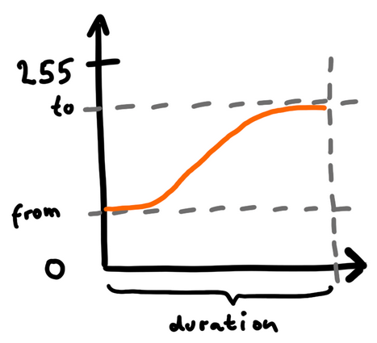

<table><tr><td>
<b>Preferring Python?</b> I just released <a href="https://github.com/jandelgado/jled-circuitpython">jled-circuitpython</a>,
a JLed implementation for CircuitPython and MicroPython.
</td></tr></table>

# JLed - Advanced LED Library


[](https://coveralls.io/github/jandelgado/jled?branch=master)

An embedded C++ library to control LEDs. It uses a **non-blocking** approach and can
control LEDs in simple (**on**/**off**) and complex (**blinking**,
**breathing** and more) ways in a **time-driven** manner.

JLed got some [coverage on Hackaday](https://hackaday.com/2018/06/13/simplifying-basic-led-effects/)
and someone did a [video tutorial for JLed](https://youtu.be/x5V2vdpZq1w)  - Thanks!

<table>
 <tr>
  <th>JLed in action</th>
  <th>Interactive JLed playground</th>
 </tr>
<tr>
  <td><a href="examples/multiled"></a></td>
  <td><a href="https://jandelgado.github.io/jled-wasm"></a>
  </td>
 </tr>
</table>

## Example

```c++
// breathe LED (on gpio 9) 6 times for 1500ms, waiting for 500ms after each run
#include <jled.h>

auto led_breathe = JLed(9).Breathe(1500).Repeat(6).DelayAfter(500);

void setup() { }

void loop() {
  led_breathe.Update();
}
```

## Contents

<!-- vim-markdown-toc GFM -->

* [Features](#features)
* [Cheat Sheet](#cheat-sheet)
* [Installation](#installation)
    * [Arduino IDE](#arduino-ide)
    * [PlatformIO](#platformio)
* [Usage](#usage)
        * [Output pipeline](#output-pipeline)
    * [Effects](#effects)
        * [Static on and off](#static-on-and-off)
            * [Static on example](#static-on-example)
        * [Blinking](#blinking)
            * [Blinking example](#blinking-example)
        * [Breathing](#breathing)
            * [Breathing example](#breathing-example)
        * [Candle](#candle)
            * [Candle example](#candle-example)
        * [FadeOn](#fadeon)
            * [FadeOn example](#fadeon-example)
        * [FadeOff](#fadeoff)
        * [Fade](#fade)
            * [Fade example](#fade-example)
        * [User provided brightness function](#user-provided-brightness-function)
            * [User provided brightness function example](#user-provided-brightness-function-example)
        * [Delays and repetitions](#delays-and-repetitions)
            * [Initial delay before effect starts](#initial-delay-before-effect-starts)
            * [Delay after effect finished](#delay-after-effect-finished)
            * [Repetitions](#repetitions)
        * [State functions](#state-functions)
            * [Update](#update)
            * [IsRunning](#isrunning)
            * [Reset](#reset)
            * [Immediate Stop](#immediate-stop)
        * [Misc functions](#misc-functions)
            * [Low active for inverted output](#low-active-for-inverted-output)
            * [Minimum- and Maximum brightness level](#minimum--and-maximum-brightness-level)
    * [Controlling a group of LEDs](#controlling-a-group-of-leds)
* [Framework notes](#framework-notes)
* [Platform notes](#platform-notes)
    * [ESP8266](#esp8266)
    * [ESP32](#esp32)
        * [Using ESP-IDF](#using-esp-idf)
    * [STM32](#stm32)
        * [Arduino framework](#arduino-framework)
    * [Raspberry Pi Pico](#raspberry-pi-pico)
* [Example sketches](#example-sketches)
    * [Building examples with PlatformIO](#building-examples-with-platformio)
    * [Building examples with the Arduino IDE](#building-examples-with-the-arduino-ide)
* [Extending](#extending)
    * [Support new hardware](#support-new-hardware)
* [Unit tests](#unit-tests)
* [Contributing](#contributing)
* [FAQ](#faq)
    * [How do I check if a JLed object is still being updated?](#how-do-i-check-if-a-jled-object-is-still-being-updated)
    * [How do I restart an effect?](#how-do-i-restart-an-effect)
    * [How do I change a running effect?](#how-do-i-change-a-running-effect)
* [Author and Copyright](#author-and-copyright)
* [License](#license)

<!-- vim-markdown-toc -->

## Features

* non-blocking
* effects: simple on/off, breathe, blink, candle, fade-on, fade-off, [user-defined](examples/morse) (e.g. morse)
* supports inverted  polarity of LED
* easy configuration using fluent interface
* can control groups of LEDs sequentially or in parallel
* Portable: Arduino, ESP8266, ESP32, Mbed, Raspberry Pi Pico and more platforms
  compatible, runs even in the [browser](https://jandelgado.github.io/jled-wasm)
* supports Arduino, [mbed](https://www.mbed.com), [Raspberry Pi
  Pico](https://github.com/raspberrypi/pico-sdk) and ESP32
  [ESP-IDF](https://www.espressif.com/en/products/sdks/esp-idf) SDK's
* well [tested](https://coveralls.io/github/jandelgado/jled)

## Cheat Sheet


## Installation

### Arduino IDE

In the main menu of the Arduino IDE, select `Sketch` > `Include Library` >
`Manage Libraries...` and search for `jled`, then press `install`.

### PlatformIO

Add `jled` to your library dependencies in your `platformio.ini` project file,
e.g.

```ini
...
[env:nanoatmega328]
platform = atmelavr
board = nanoatmega328
framework = arduino
lib_deps=jled
...
```

## Usage

First, the LED object is constructed and configured, then the state is updated
with subsequent calls to the `Update()` method, typically from the `loop()`
function. While the effect is active, `Update` returns `true`, otherwise
`false`.

The constructor takes the pin, to which the LED is connected to as
the only argument. Further configuration of the LED object is done using a fluent
interface, e.g. `JLed led = JLed(13).Breathe(2000).DelayAfter(1000).Repeat(5)`.
See the examples section below for further details.

#### Output pipeline

First the configured effect (e.g. `Fade`) is evaluated for the current time
`t`. JLed internally uses unsigned bytes to represent brightness values,
ranging from 0 to 255. Next, the value is scaled to the limits set by
`MinBrightness` and `MaxBrightness` (optionally). When the effect is configured
for a low-active LED using `LowActive`, the brightness value will be inverted,
i.e., the value will be subtracted from 255. Finally the value is passed to the
hardware abstraction, which might scale it to the resolution used by the actual
device (e.g. 10 bits for an ESP8266). Finally the brightness value is written
out to the configure GPIO.

```text
┌───────────┐    ┌────────────┐    ┌─────────┐    ┌────────┐    ┌─────────┐    ┌────────┐
│ Evaluate  │    │  Scale to  │    │  Low    │YES │ Invert │    │Scale for│    │Write to│
│ effect(t) ├───►│ [min, max] ├───►│ active? ├───►│ signal ├───►│Hardware ├───►│  GPIO  │
└───────────┘    └────────────┘    └────┬────┘    └────────┘    └───▲─────┘    └────────┘
                                        │ NO                        │
                                        └───────────────────────────┘
```

### Effects

#### Static on and off

Calling `On(uint16_t period=1)` turns the LED on. To immediately turn a LED on,
make a call like `JLed(LED_BUILTIN).On().Update()`. The `period` is optional
and defaults to 1ms.

`Off()` works like `On()`, except that it turns the LED off, i.e., it sets the
brightness to 0.

Use the `Set(uint8_t brightness, uint16_t period=1)` method to set the
brightness to the given value, i.e., `Set(255)` is equivalent to calling `On()`
and `Set(0)` is equivalent to calling `Off()`.

Technically, `Set`, `On` and `Off` are effects with a default period of 1ms, that
set the brightness to a constant value. Specifying a different period has an
effect on when the `Update()` method will be done updating the effect and
return false (like for any other effects). This is important when for example
in a `JLedSequence` the LED should stay on for a given amount of time.

##### Static on example

```c++
#include <jled.h>

// turn builtin LED on after 1 second.
auto led = JLed(LED_BUILTIN).On().DelayBefore(1000);

void setup() { }

void loop() {
  led.Update();
}
```

#### Blinking

In blinking mode, the LED cycles through a given number of on-off cycles, on-
and off-cycle durations are specified independently. The `Blink()` method takes
the duration for the on- and off cycle as arguments.

##### Blinking example

```c++
#include <jled.h>

// blink internal LED every second; 1 second on, 0.5 second off.
auto led = JLed(LED_BUILTIN).Blink(1000, 500).Forever();

void setup() { }

void loop() {
  led.Update();
}
```

#### Breathing

In breathing mode, the LED smoothly changes the brightness using PWM. The
`Breathe()` method takes the period of the effect as an argument.

##### Breathing example

```c++
#include <jled.h>

// connect LED to pin 13 (PWM capable). LED will breathe with period of
// 2000ms and a delay of 1000ms after each period.
auto led = JLed(13).Breathe(2000).DelayAfter(1000).Forever();

void setup() { }

void loop() {
  led.Update();
}
```

It is also possible to specify fade-on, on- and fade-off durations for the
breathing mode to customize the effect.

```c++
// LED will fade-on in 500ms, stay on for 1000ms, and fade-off in 500ms.
// It will delay for 1000ms afterwards and continue the pattern.
auto led = JLed(13).Breathe(500, 1000, 500).DelayAfter(1000).Forever();
```

#### Candle

In candle mode, the random flickering of a candle or fire is simulated.
The builder method has the following signature:
  `Candle(uint8_t speed, uint8_t jitter, uin16_t period)`

* `speed` - controls the speed of the effect. 0 for fastest, increasing speed
  divides into halve per increment. The default value is 7.
* `jitter` - the amount of jittering. 0 none (constant on), 255 maximum. Default
  value is 15.
* `period` - Period of effect in ms.  The default value is 65535 ms.

The default settings simulate a candle. For a fire effect for example use
call the method with `Candle(5 /*speed*/, 100 /* jitter*/)`.

##### Candle example

```c++
#include <jled.h>

// Candle on LED pin 13 (PWM capable).
auto led = JLed(13).Candle();

void setup() { }

void loop() {
  led.Update();
}
```

#### FadeOn

In FadeOn mode, the LED is smoothly faded on to 100% brightness using PWM. The
`FadeOn()` method takes the period of the effect as an argument.

The brightness function uses an approximation of this function (example with
period 1000):

[](https://www.wolframalpha.com/input/?i=plot+(exp(sin((t-1000%2F2.)*PI%2F1000))-0.36787944)*108.0++t%3D0+to+1000)

##### FadeOn example

```c++
#include <jled.h>

// LED is connected to pin 9 (PWM capable) gpio
auto led = JLed(9).FadeOn(1000).DelayBefore(2000);

void setup() { }

void loop() {
  led.Update();
}
```

#### FadeOff

In FadeOff mode, the LED is smoothly faded off using PWM. The fade starts at
100% brightness. Internally it is implemented as a mirrored version of the
FadeOn function, i.e., FadeOff(t) = FadeOn(period-t).  The `FadeOff()` method
takes the period of the effect as argument.

#### Fade

The Fade effect allows to fade from any start value `from` to any target value
`to` with the given duration. Internally it sets up a `FadeOn` or `FadeOff`
effect and `MinBrightness` and `MaxBrightness` values properly. The `Fade`
method take three arguments: `from`, `to` and `duration`.

<a href="examples/fade_from_to"></a>

##### Fade example

```c++
#include <jled.h>

// fade from 100 to 200 with period 1000
auto led = JLed(9).Fade(100, 200, 1000);

void setup() { }

void loop() {
  led.Update();
}
```

#### User provided brightness function

It is also possible to provide a user defined brightness evaluator. The class
must be derived from the `jled::BrightnessEvaluator` class and implement
two methods:

* `uint8_t Eval(uint32_t t) const` - the brightness evaluation function that
  calculates a brightness for the given time `t`. The brightness must be returned
  as an unsigned byte, where 0 means LED off and 255 means full brightness.
* `uint16_t Period() const` - period of the effect.

All time values are specified in milliseconds.

The [user_func](examples/user_func) example demonstrates a simple user provided
brightness function, while the [morse](examples/morse) example shows how a more
complex application, allowing you to send morse codes (not necessarily with an
LED), can be realized.

##### User provided brightness function example

The example uses a user provided function to calculate the brightness.

```c++
class UserEffect : public jled::BrightnessEvaluator {
  public:
    uint8_t Eval(uint32_t t) const override {
        // this function changes between 0 and 255 and
        // vice versa every 250 ms.
        return 255*((t/250)%2);
    }
    // duration of effect: 5 seconds.
    uint16_t Period() const override { return 5000; }
};
```

#### Delays and repetitions

##### Initial delay before effect starts

Use the `DelayBefore()` method to specify a delay before the first effect starts.
The default value is 0 ms.

##### Delay after effect finished

Use the `DelayAfter()` method to specify a delay after each repetition of
an effect. The default value is 0 ms.

##### Repetitions

Use the `Repeat()` method to specify the number of repetitions. The default
value is 1 repetition. The `Forever()` methods sets to repeat the effect
forever. Each repetition includes a full period of the effect and the time
specified by `DelayAfter()` method.

#### State functions

##### Update

Call `Update(int16_t *pLast=nullptr)` or `Update(uint32_t t, int16_t *pLast=nullptr)`
to periodically update the state of the LED.

`Update` returns `true`, if the effect is active, or `false` when it finished.
`Update()` is a shortcut to call `Update(uint32_t t)` with the current time in
milliseconds.

To obtain the value of the last written brightness value (after applying min-
and max-brightness transformations), pass an additional optional pointer
`*pLast` , where this value will be stored, when it was written. Example:

```c++
int16_t lastVal = -1;
led.Update(&lastVal);
if (lastVal != -1) {
    // the LED was updated with the brightness value now stored in lastVal
    ...
}
```

Most of the time just calling `Update()` without any parameters is what you want.

See [last_brightness](examples/last_brightness) example for a working example.

##### IsRunning

`IsRunning()` returns `true` if the current effect is running, else `false`.

##### Reset

A call to `Reset()` brings the JLed object to its initial state. Use it when
you want to start-over an effect.

##### Immediate Stop

Call `Stop()` to immediately turn the LED off and stop any running effects.
Further calls to `Update()` will have no effect, unless the Led is reset using
`Reset()` or a new effect is activated. By default, `Stop()` sets the current
brightness level to `MinBrightness`.

`Stop()` takes an optional argument `mode` of type `JLed::eStopMode`:

* if set to `JLed::eStopMode::KEEP_CURRENT`, the LEDs current level will be kept
* if set to `JLed::eStopMode::FULL_OFF` the level of the LED is set to `0`,
  regardless of what `MinBrightness` is set to, effectively turning the LED off
* if set to `JLed::eStopMode::TO_MIN_BRIGHTNESS` (default behavior), the LED
  will set to the value of `MinBrightness`

```c++
// stop the effect and set the brightness level to 0, regardless of min brightness
led.Stop(JLed::eStopMode::FULL_OFF);
```

#### Misc functions

##### Low active for inverted output

Use the `LowActive()` method when the connected LED is low active. All output
will be inverted by JLed (i.e., instead of x, the value of 255-x will be set).

##### Minimum- and Maximum brightness level

The `MaxBrightness(uint8_t level)` method is used to set the maximum brightness
level of the LED. A level of 255 (the default) is full brightness, while 0
effectively turns the LED off. In the same way, the `MinBrightness(uint8_t level)`
method sets the minimum brightness level. The default minimum level is 0. If
minimum or maximum brightness levels are set, the output value is scaled to be
within the interval defined by `[minimum brightness, maximum brightness]`: a
value of 0 will be mapped to the minimum brightness level, a value of 255 will
be mapped to the maximum brightness level.

The `uint_8 MaxBrightness() const` method returns the current maximum
brightness level. `uint8_t MinBrightness() const` returns the current minimum
brightness level.

### Controlling a group of LEDs

The `JLedSequence` class allows controlling a group of `JLed` objects
simultaneously, either in parallel or sequentially, starting the next `JLed`
effect when the previous finished. The constructor takes the mode (`PARALLEL`,
`SEQUENCE`), an array of `JLed` objects and the size of the array, e.g.

```c++
JLed leds[] = {
    JLed(4).Blink(750, 250).Repeat(10),
    JLed(3).Breathe(2000).Repeat(5);
};

auto sequence = JLedSequence(JLedSequence::eMode::PARALLEL, leds).Repeat(2);

void setup() {
}

void loop() {
    sequence.Update();
}
```

Because the size of the array is known at compile time in this example, it is
not necessary to pass the array size to the constructor. A second constructor
is available in case the `JLed` array is created dynamically at runtime:
`JLed(eMode mode, JLed* leds, size_t n)`.

The `JLedSequence` provides the following methods:
* `Update()` - updates the active `JLed` objects controlled by the sequence.
  Like the `JLed::Update()` method, it returns `true` if an effect is running,
  else `false`.
* Use the `Repeat(n)` method to specify the number of repetitions. The default
  value is 1 repetition. The `Forever()` methods sets to repeat the sequence
  forever.
* `Stop()` - turns off all `JLed` objects controlled by the sequence and
   stops the sequence. Further calls to `Update()` will have no effect.
* `Reset()` - Resets all `JLed` objects controlled by the sequence and
   the sequence, resulting in a start-over.

## Framework notes

JLed supports the Arduino and [mbed](https://www.mbed.org) frameworks. When
using platformio, the framework to be used is configured in the `platform.ini`
file, as shown in the following example, which for example selects the `mbed`
framework:

```ini
[env:nucleo_f401re_mbed]
platform=ststm32
board = nucleo_f401re
framework = mbed
build_flags = -Isrc
src_filter = +<../../src/>  +<./>
upload_protocol=stlink
```

An [mbed example is provided here](examples/multiled_mbed/multiled_mbed.cpp).
To compile it for the F401RE, make your [plaform.ini](platform.ini) look like:

```ini
...
[platformio]
default_envs = nucleo_f401re_mbed
src_dir = examples/multiled_mbed
...
```

## Platform notes

### ESP8266

The DAC of the ESP8266 operates with 10 bits, every value JLed writes out gets
automatically scaled to 10 bits, since JLed internally only uses 8 bits.  The
scaling methods make sure that min/max relationships are preserved, i.e., 0 is
mapped to 0 and 255 is mapped to 1023. When using a user-defined brightness
function on the ESP8266, 8-bit values must be returned, all scaling is done by
JLed transparently for the application, yielding platform-independent code.

### ESP32

When compiling for the ESP32, JLed uses `ledc` functions provided by the ESP32
ESP-IDF SDK.  (See [esspressif
documentation](https://docs.espressif.com/projects/esp-idf/en/latest/api-reference/peripherals/ledc.html)
for details).

The `ledc` API connects so-called channels to GPIO pins, enabling them to use
PWM. There are 16 channels available. Unless otherwise specified, JLed
automatically picks the next free channel, starting with channel 0 and wrapping
over after channel 15. To manually specify a channel, the JLed object must be
constructed this way:

```c++
auto esp32Led = JLed(jled::Esp32Hal(2, 7)).Blink(1000, 1000).Forever();
```

The `jled::Esp32Hal(pin, chan)` constructor takes the pin number as the first
argument and the ESP32 ledc channel number on the second position. Note that
using the above-mentioned constructor results in non-platform independent code,
so it should be avoided and is normally not necessary.

For completeness, the full signature of the Esp32Hal constructor is

```
Esp32Hal(PinType pin,
         int chan = kAutoSelectChan,
         uint16_t freq = 5000,
         ledc_timer_t timer = LEDC_TIMER_0)
```

which also allows to override the default frequency and timer used, when needed.

#### Using ESP-IDF

Since JLed uses the ESP-IDF SDK, JLed can also be directly used in ESP-IDF
projects, without the need of using the Arduino Framework (which is also
possible). See these repositories for example projects:

* https://github.com/jandelgado/jled-esp-idf-example
* https://github.com/jandelgado/jled-esp-idf-platformio-example

### STM32

#### Arduino framework

I had success running JLed on a [STM32 Nucleo64 F401RE
board](https://www.st.com/en/evaluation-tools/nucleo-f401re.html) using this
[STM32 Arduino
core](https://github.com/rogerclarkmelbourne/Arduino_STM32/tree/master/STM32F4)
and compiling examples from the Arduino IDE. Note that the `stlink` is
necessary to upload sketches to the microcontroller.

### Raspberry Pi Pico

When using JLed on a Raspberry Pi Pico, the Pico-SDK and tools can be
used.  The Pico supports up to 16 PWM channels in parallel. See
the [pico-demo](examples/raspi_pico) for an example and build instructions when
the Pico-SDK is used.

A probably easier approach is to use the Arduino platform. See
[platformio.ini](platformio.ini) for details (look for
`env:raspberrypi_pico_w`, which targets the Raspberry Pi Pico W.

## Example sketches

Example sketches are provided in the [examples](examples/) directory.

* [Hello, world](examples/hello)
* [Turn LED on after a delay](examples/simple_on)
* [Breathe effect](examples/breathe)
* [Candle effect](examples/candle)
* [Fade LED on](examples/fade_on)
* [Fade LED off](examples/fade_off)
* [Fade from-to effect](examples/fade_from_to)
* [Pulse effect](examples/pulse)
* [Controlling multiple LEDs in parallel](examples/multiled)
* [Controlling multiple LEDs in parallel (mbed)](examples/multiled_mbed)
* [Controlling multiple LEDs sequentially](examples/sequence)
* [Simple User provided effect](examples/user_func)
* [Morsecode example](examples/morse)
* [Last brightness value example](examples/last_brightness)
* [Custom HAL example](examples/custom_hal)
* [Custom PCA9685 HAL](https://github.com/jandelgado/jled-pca9685-hal)
* [Dynamically switch sequences](https://github.com/jandelgado/jled-example-switch-sequence)
* [JLed compiled to WASM and running in the browser](https://jandelgado.github.io/jled-wasm)
* [Raspberry Pi Pico Demo](examples/raspi_pico)
* [ESP32 ESP-IDF example](https://github.com/jandelgado/jled-esp-idf-example)
* [ESP32 ESP-IDF PlatformIO example](https://github.com/jandelgado/jled-esp-idf-platformio-example)

### Building examples with PlatformIO

To build an example using [the PlatformIO ide](http://platformio.org/),
uncomment the example to be built in the [platformio.ini](platformio.ini)
project file, e.g.:

```ini
[platformio]
; uncomment example to build
src_dir = examples/hello
;src_dir = examples/breathe
```

### Building examples with the Arduino IDE

To build an example sketch in the Arduino IDE, select an example from
the `File` > `Examples` > `JLed` menu.

## Extending

### Support new hardware

JLed uses a very thin hardware abstraction layer (HAL) to abstract access to
the actual MCU/framework used (e.g. ESP32, ESP8266). The HAL encapsulates
access to the GPIO and clock functionality of the MCU under the framework being
used.  During the unit tests, mocked HAL instances are used, enabling tests to
check the generated output.  The [Custom HAL example](examples/custom_hal)
provides an example for a user defined HAL.

## Unit tests

JLed comes with an exhaustive host-based unit test suite. Info on how to run
the host-based provided unit tests [is provided here](test/README.md).

## Contributing

* fork this repository
* create your feature branch
* add code
* add [unit test(s)](test/)
* add [documentation](README.md)
* make sure the cpp [linter](https://github.com/cpplint/cpplint) does not
  report any problems (run `make lint`). Hint: use `clang-format` with the
  provided [settings](.clang-format)
* commit changes
* submit a PR

## FAQ

### How do I check if a JLed object is still being updated?

* Check the return value of the `JLed::Update` method: the method returns `true` if
  the effect is still running, otherwise `false`.
* The `JLed::IsRunning` method returns `true` if an effect is running, else `false`.

### How do I restart an effect?

Call `Reset()` on a `JLed` object to start over.

### How do I change a running effect?

Just 'reconfigure' the `JLed` with any of the effect methods (e.g. `FadeOn`,
`Breathe`, `Blink` etc). Time-wise, the effect will start over.

## Author and Copyright

Copyright 2017-2022 by Jan Delgado, jdelgado[at]gmx.net.

## License

[MIT](LICENSE)
