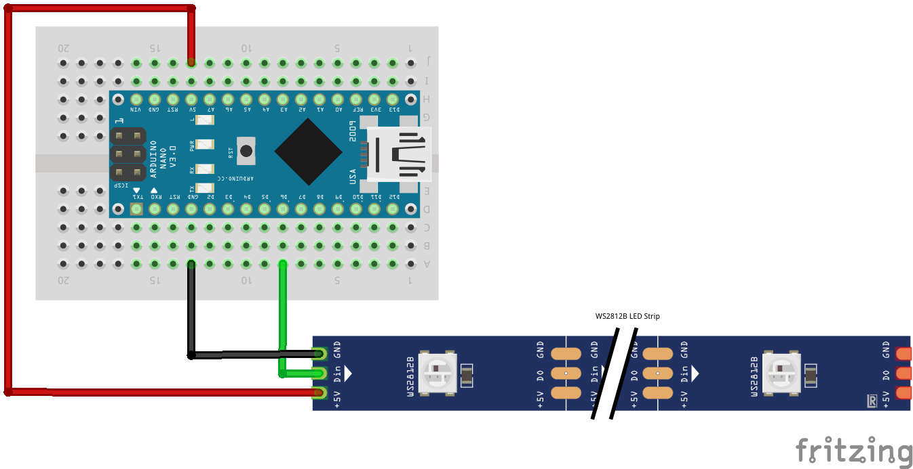

# FastLED example

Since version 5 JLed also supports RGB-LEDs. Typical RGB-LEDs are driven like conventional
LEDs using Pulse-Width-Modulation (PWM), requiring 3 GPIO-pins per LED, which becomes problematic,
if you want to drive a large number of LEDs (and also comes with some wiring challenges).

Luckily there are "intelligent" LEDs, sometimes called **Neopixel**, like the e.g. the
[WS2812B](https://en.wikipedia.org/wiki/LED_strip_light), that allow to control a
large number of LEDs over a single wire. The famous
[FastLED](https://github.com/FastLED/FastLED) library was built to drive these kind
of LEDs.

## What

This example shows how to use the JLed effect machinery and have FastLED handle the output to
a connected WS2812B Neopixel stripe.

## How does it work?

FastLED operates on an array of RGB colors (`CRGB` values), where each entry reflects the color of
the corresponding LED in the real hardware. The demo uses a `FastLedHal` to direct JLeds output to
the `CRGB` array instead to real hardware. Every `JFastLed` instance targets one entry in the array.
FastLED then does the hardware interfacing part and sends the color information out from the `CRGB`
array to the LED strip.

```text
                      CRGB array
┌──────────┐     ┌──┬──┬──┬──┬──┬──┐      ┌──────────┐     ┌───────────┐
│   JLed   ┼────►│  │  │  │  │  │  │◄─────┤ FastLED  ├────►│ LED strip │
└──────────┘     └──┴──┴──┴──┴──┴──┘      └──────────┘     └───────────┘
         <writes to>             <reads from>      <controls>
```

Dependencies: To compile the example, you need the FastLED dependency installed. Select the
`nanoatmega328-fastled` PlatformIO environment, which pulls in FastLED via `lib_deps`.

## Wiring

This example uses an Arduino nano, but other micro controllers will work too.
Connect the data pin to `D6`, `GND` to `GND` and `VCC` to `+5V` of the Arduino nano.


