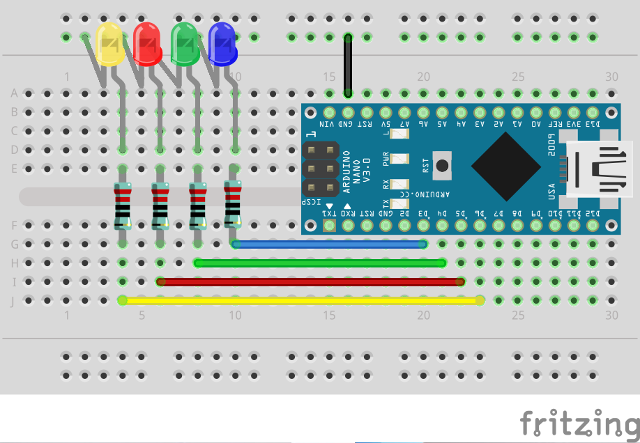
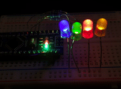

# Simple LED group example

This example controls 4+1 LEDs, showing different effects, yet all synchronized:

- blue LED: breathe (period 2s)
- green LED: blink (0.75s on/0.25s off)
- red LED: fade off (period 1s)
- yellow LED: fade on (period 1s)
- built-in LED: blink (0.5s on/0.5s off)

## Wiring

## Result

