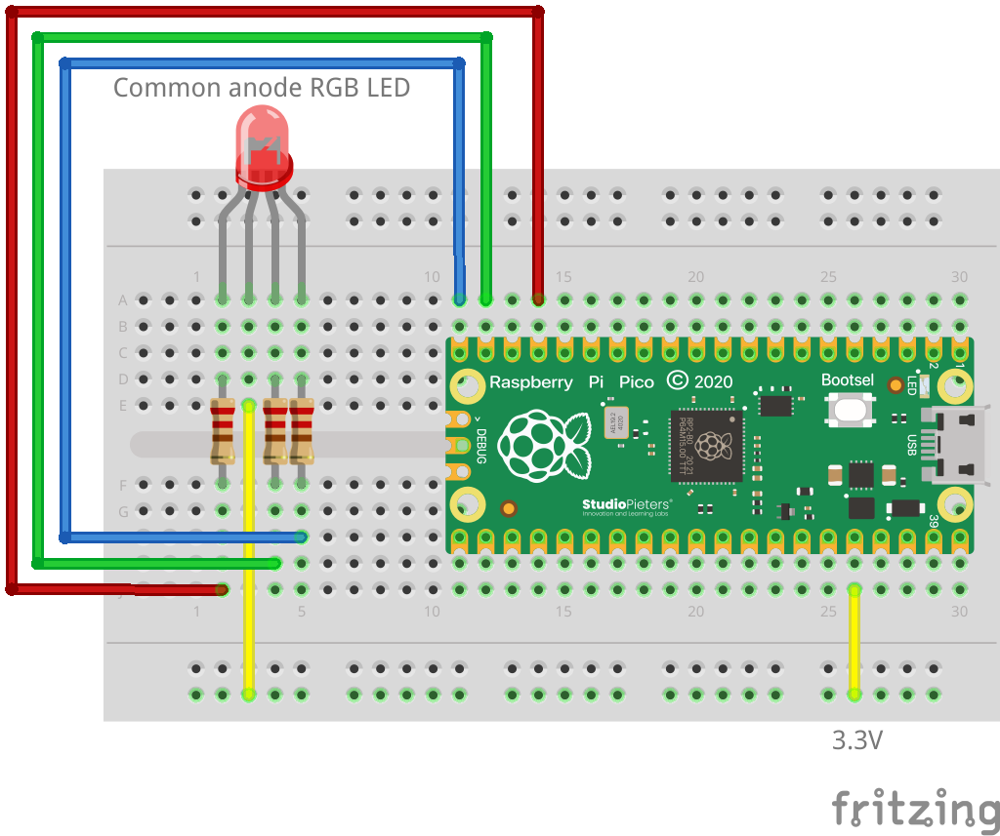

# Hello, RGB example

Minimal `JLedRGB` example: blinks an RGB LED red/green 5 times. The LED used
here is low-active ("common anode") and is connected to the GPIOs 13 (red),
14 (green) and 15 (blue).

## Wiring

