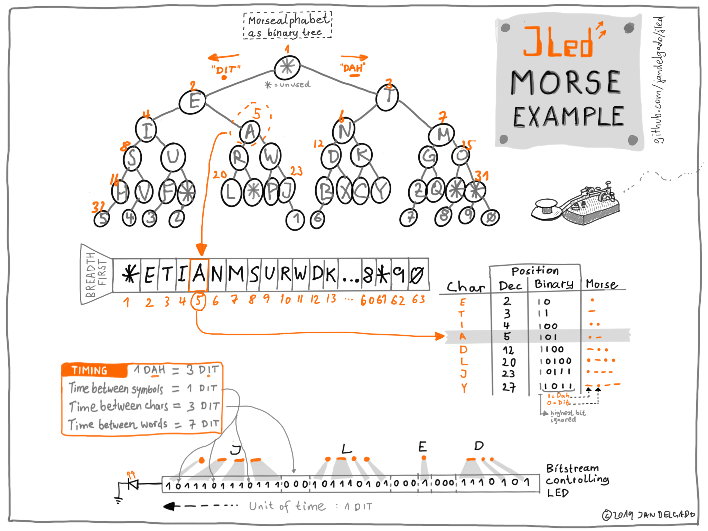

# JLed morse example

The morse example uses the morse alphabet encoded in a binary tree to 
generate morse code using a JLed user defined brightness class. The text
to be morsed is transformed into morse code and then transformed into a 
sequence of `1` and `0` which are written out to a GPIO controlling a LED.

