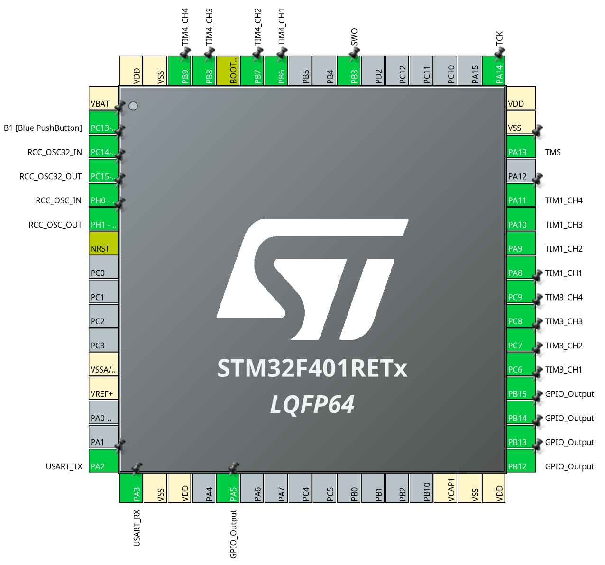

# JLed STM32Cube demo

This demo shows how to use JLed with a native STM32Cube application. It is an STM32Cube project meant
to be built with [PlatformIO](https://platformio.org/) (`framework = stm32cube`). Most of the files
were created with [STM32CubeMX](https://www.st.com/en/development-tools/stm32cubemx.html).
STM32CubeMX lets you configure your STM32 and then generates a project skeleton. During
configuration, you decide, for example, how the various pins of the microcontroller should behave
(e.g. input, output, PWM, etc.) and configure timers. The `stm32.ioc` file is the STM32CubeMX
project file. You can open it in STM32CubeMX to change the pin and timer configuration and
regenerate the skeleton.

A typical `platformio.ini` for an STM32Cube program like this demo looks like this:

```ini
[env:nucleo_f401re]
platform = ststm32
framework = stm32cube
board = nucleo_f401re
board_build.stm32cube.custom_config_header = yes
lib_compat_mode = off
lib_deps = jandelgado/JLed@5.0.0

[platformio]
include_dir = Inc
src_dir = Src
```

This example project is configured for the Nucleo F401RE board and basically sets up the pins so we
can use them as PWM outputs for JLed:



After the pins are configured, the code generator is run with these settings:

- Project Type: `Makefile`
- [x] Copy only the necessary library files
- [x] Generate peripheral initialization as a pair of '.c/.h' per peripheral

All files below the `Core/` directory were copied into this PlatformIO project folder,
except for the `app.cpp` file, which we created:

```
├── Inc
│   ├── gpio.h
│   ├── main.h
│   ├── stm32f4xx_hal_conf.h
│   ├── stm32f4xx_it.h
│   ├── tim.h
│   └── usart.h
└── Src
    ├── app.cpp
    ├── gpio.c
    ├── main.c
    ├── stm32f4xx_hal_msp.c
    ├── stm32f4xx_it.c
    ├── syscalls.c
    ├── sysmem.c
    ├── system_stm32f4xx.c
    ├── tim.c
    └── usart.c

```

The generated files reflect configuration settings made in the STM32CubeMX tool and
are specific to the selected microcontroller board (here: Nucleo F401RE). Note that
the `Src` and `Inc` directories are uppercase in this project. This is because STM32CubeMX
generates these directories uppercase and we kept it that way.

<!-- doc:link Src -->
<!-- doc:link Inc -->

The file [main.c](Src/main.c) contains the generated `main()` function, the program's entry point.
It performs the usual STM32Cube startup (clock configuration and peripheral initialization) and is
left untouched apart from two lines placed inside the `USER CODE` markers that STM32CubeMX
preserves across regeneration: a prototype for `app_main()` and a call to it after the
`MX_TIMx_Init()` calls:

```c
/* USER CODE BEGIN PFP */
extern void app_main(void);  /* implemented in app.cpp, runs the JLed loop */
/* USER CODE END PFP */
```

```c
  MX_TIM4_Init();
  /* USER CODE BEGIN 2 */
  app_main();
  /* USER CODE END 2 */
```

Since JLed is C++, the LED logic lives in a C++ source file, [app.cpp](Src/app.cpp). It implements
`app_main()` as `extern "C"`, instantiates the JLed objects, groups them, and runs the main loop.
Hardware initialization stays in the generated code, so regenerating the project with STM32CubeMX
needs no changes to `app.cpp` and no copying of generated code:

<!-- doc:add Src/app.cpp -->

```c++
extern "C" {
#include "main.h"
#include "tim.h"  // htim1/htim4 handles
}

#include <jled.h>  // must come after main.h so the STM32Cube HAL header is visible

// Called from the generated main() in main.c, after all MX_TIMx_Init() calls.
extern "C" void app_main(void) {
    // JLed objects are created here, after MX_TIMx_Init(), never as globals: the
    // Stm32CubeHal constructor starts PWM and reads htim->Init.Period eagerly.
    auto led1 = JLed({&htim1, TIM_CHANNEL_1}).Blink(500, 250, 3).DelayAfter(1000).Forever();
    auto led2 = JLedHD({&htim1, TIM_CHANNEL_2}).FadeOn(1500).Forever();
    auto led3 = JLedHD({&htim1, TIM_CHANNEL_3}).FadeOff(1500).DelayAfter(1000).Forever();
    auto led4 = JLed({&htim1, TIM_CHANNEL_4}).Blink(250, 250, 3).Forever();
    auto led5 = JLed({&htim4, TIM_CHANNEL_1}).Candle().Forever();
    auto led6 = JLedHD({&htim4, TIM_CHANNEL_2}).Breathe(2000).Forever();
    auto led7 = JLedHD({&htim4, TIM_CHANNEL_3}).Breathe(2000).MinBrightness(50).DelayAfter(1000).Forever();

    // A low-active channel exercises hardware invert via LowActive().
    auto led8 = JLedHD({&htim4, TIM_CHANNEL_4}).Breathe(15000).DelayAfter(1000).LowActive().Forever();

    // All channels run in parallel, driven together through a group.
    JLedRef leds[]{&led1, &led2, &led3, &led4, &led5, &led6, &led7, &led8};
    auto group = JLedRefGroup::Parallel(leds);
    while (1) {
        group.Update();
    }
}
```

`app_main()` is called from `USER CODE BEGIN 2`, which runs after all `MX_TIMx_Init()` calls, so the
JLed constructors see initialized timers.

It is important that the `jled.h` include comes after the STM32 `main.h` include, so
symbols used by the STM32 JLed HAL are available there. JLed object instantiation is
different here from other platforms: normally just the pin number is passed to the
`JLed` constructor, e.g. `JLed(5)` or `JLed(LED_BUILTIN)`. This is different on the
STM32Cube platform, since PWM pins are not addressed by the pin numbers, but by a
combination of configured timer and channel, e.g., `JLed({&htim1, TIM_CHANNEL_3})`
instantiates a `JLed` object for timer channel 3 on timer 1. `htim1` is generated
by STM32CubeMX during code generation and pulled in through the `tim.h` header.

This example project is built using the top level `platformio.ini`
project file and the `env:nucleo_f401re_stm32cube` environment, alternatively run
`make upload-stm32cube_demo ENV=nucleo_f401re_stm32cube` to build and upload the example.

## Regenerating with stm32pio

[stm32pio](https://github.com/ussserrr/stm32pio) drives STM32CubeMX from the command
line to (re)generate the PlatformIO project skeleton from the `stm32.ioc` file. You can
run it without installing it using [uv](https://docs.astral.sh/uv/), for example from
this directory `uvx stm32pio generate` (a local STM32CubeMX installation is still
required).

## Troubleshooting: a channel stays dark

JLed's STM32Cube HAL assumes every timer channel you hand it is already set up
for PWM output. The constructor calls `HAL_TIM_PWM_Start()` and `analogWrite()`
writes the compare register (`CCR`), but it does not change the channel's
output-compare mode. If a channel was configured in STM32CubeMX as plain
"Output Compare" (`TIM_OCMODE_TIMING`) instead of "PWM Generation"
(`TIM_OCMODE_PWM1`), the compare match never drives the pin. Writing `CCR` has
no visible effect and the LED stays dark, even though the GPIO alternate
function and `HAL_TIM_PWM_Start()` all look correct.

Fix it in STM32CubeMX by setting the channel's mode to "PWM Generation CHx" and
regenerating. In the generated `tim.c` the working channels go through
`HAL_TIM_PWM_ConfigChannel()` with `sConfigOC.OCMode = TIM_OCMODE_PWM1`.

## References

- [How to build a "Blink LED" project from STM32CubeMX](https://www.youtube.com/watch?v=6RqUkFIeN6w)
- [stm32pio](https://github.com/ussserrr/stm32pio): automate CubeMX + PlatformIO projects
- [STM32cube framework description for PlatformIO](https://docs.platformio.org/en/latest/frameworks/stm32cube.html)
